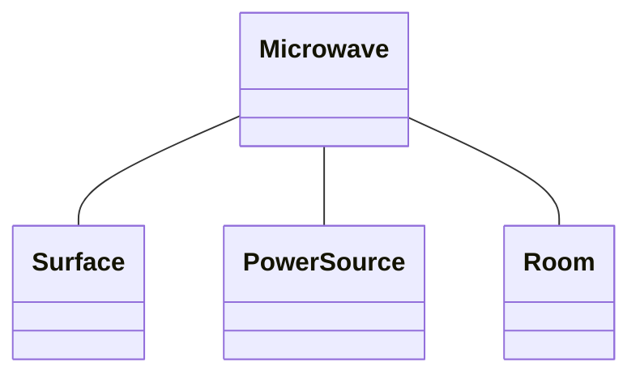

# 目次

これは連載「あすかの怪文書」の記事です。[目次はこちらからご覧になれます](https://zenn.dev/kmy/articles/asuka-cs-0-index)

# 言い訳

オブジェクト指向は本書のメインテーマに深く関わります。C#でプログラムを作るにあたって避けて通れませんし、C#やJavaなどはオブジェクト指向プログラミングを前提に設計されている以上、これを理解せずして言語設計者の想定した十分なパフォーマンスを発揮することは不可能です。
実践的なプログラミングをおこなうにあたって非常に重要な概念のため、ここでも分量を割いて、基本中の基本、その中でもさらに基本に限って説明します。

:::message
本来これはオブジェクト指向専門書に預けるべき説明なのですが、現場やネットで入門書に多くを期待しすぎている人がいたため、実践的なプログラミングという観点からここでも基本だけを説明します。
まず、オブジェクト指向の話は、プログラミング入門書では触れられないことが非常に多いです。あなたがこれまでオブジェクト指向だと思っていたものは、おそらくクラスを使う手段、クラスの作り方に関するこく簡単な説明のみであり、オブジェクト指向の本質ではありません。それもそのはず、考えうる理由は２つあります。
１つ目は、オブジェクト指向をまじめに説明すると１つの分厚い本ができるからです。オブジェクト指向はそれ自体が複雑であるだけでなく、言語をまたがって考え方の多くは共通しています。C#の入門書、Javaの入門書、Kotlinの入門書などにいちいちオブジェクト指向の話を挿入すると、必ず重複します。複数の書籍に全く同じ話が100ページにもわたって入っているのは非効率的でしょう（DRY原則違反）。入門書にオブジェクト指向の説明がほとんどないのはまったくもって合理的です。
２つ目は、オブジェクト指向は複雑な概念であり、その道にある程度熟練している人による説明が求められるからです。実際、職場での経験やインターネットの記事を拝見してもトランザクションスクリプトをオブジェクト指向だと思っている人は多くいますがそれだけでなく、ドメインモデルに対する理解があやふやな人、完璧に見えても一部の知識に間違いがある人は非常に多いという印象を受けました。オブジェクト指向にいくつかの分派があるということは、問題をさらに複雑にさせています。考え方について、どれが正しいのか、どれが間違っているのか正確に判別できる人はまれです。私はもちろん、オブジェクト指向を理解している自信はありません。私にとってオブジェクト指向を理解したと宣言することとは、ネットスラングである「C言語完全に理解した」と大差なく、大変危険な行為であると思っています。私はMicrosoft関係者でもGoogle関係者でもないし、Microsoft MVPでもないし、それに準ずる資格や称号を持っているわけではありません。それに私は、[はしがき](https://zenn.dev/kmy/articles/asuka-cs-0-index)でも述べたとおり、プログラミングを理解している自信がまったくありません。はっきり言います。**私の文章を読んでオブジェクト指向を理解した気にならないでください**。
:::

現実問題として、入門書を読めばオブジェクト指向を知らなくてもある程度プログラムが書けてしまうというのが厄介です。現在の職場では、一度プログラムを書けてしまうとそれだけで満足してしまって、そのまま実務に行く人が多い印象を受けました（おそらく私が会社を間違えたかもしれません）。実践的なプログラミングにおいて、オブジェクト指向の正確な理解（笑）は避けて通れません。なので本連載でも、**誤解のみによって成り立っている可能性は非常に高いですが**、「やむを得ない」と判断した上で、オブジェクト指向について私の理解の中でもこくこく基本的なところだけ触れます。オブジェクト指向について正しく知りたいと思えば、さらにレベルの高い専門書を購入されることを非常に強くお勧めします。本連載で私が語るオブジェクト指向は、プログラミング超初心者にありがちな空虚な誇大妄想の一種だと思って笑って読み飛ばしてください。

# オブジェクト指向の必要性

私にとって、オブジェクト指向とは処理の部品化です。**カプセル化**によってクラスをアプリケーションの一部品にします。部品を組み合わせ、積み立てることで１つの大きなプログラムを作るイメージです。部品の中の構造は、その部品にしか分かりません。部品は定められた入力と出力を持ち、入力が出力に変化する過程をブラックボックス化します。部品を使う側は、その部品の表面だけを見ていればよいのです。



例えばあなたは電子レンジを使います。このとき、あなたは電子レンジに食品を入れて、開始ボタンと停止ボタンを操作します。すると食べ物が適温になって出てきます。このとき、電子レンジはどのような動作原理で動いているのか、また食べ物が温かくなるメカニズムを、あなたは特に考えないはずです。細かいことは考えず、ただ「温められた食品」という結果のみを、あなたは期待するはずです。
また、電子レンジの新しい製品が出てきても、基本的な操作は変わらず、以前と同じように使い続けることが出来ます。電子レンジが故障して修理してもらったときも、操作方法は変わりません。

電子レンジの内部構造は非常に複雑で、理解するには専門知識が必要なはずです。それにも関わらず、機械に関してまったくの素人であるはずのあなたが電子レンジを使いこなせるのは、電子レンジの機能が**ブラックボックス化**しているからです。
クラスも同じです。どれだけ複雑な処理が内包されていても、その表面の入力と出力だけを理解していれば、このクラスを使うことができます。こうして、本来複雑であるはずのものが、外側から見るとあたかもシンプルであるかのように振る舞うのです。あとは、幼稚園児が積み木のおもちゃを積み上げるのと一緒です。複雑な処理を単純化することで複雑な処理同士を接続しやすくします。
また、クラスを拡張して新しい機能を追加するときも、オブジェクト指向に基づいて適切に設計されたプログラムであれば、他のクラスへ及ぼす影響は最小限になります。仕様を変更するときも、入力と出力さえ変わらなければ、他のクラスへの影響はほとんどありません。プログラムを部品化することで専門性をそれぞれのクラスに内包でき、保守性、拡張性の向上に大きく貢献します。

# トランザクションスクリプト／ドメインモデル

トランザクションスクリプトとドメインモデルは、クラスの作り方に関する考え方の種類です。私は、前者はオブジェクト指向ではなく、後者はオブジェクト指向であると考えています。おそらく同じような考え方の人は多いでしょう。しかし大抵の会社の実際の職場では、真逆の考えを持っている人のほうが多いかもしれません。私のこれまでの非常に浅く浅はかな経験から、ドメインモデルは、日本の職場ではマイノリティーな存在だという印象を持っています。
しかし、私がドメインモデルを習得してからは、C#のようなオブジェクト指向言語はトランザクションスクリプトではなく、ドメインモデルを前提に設計されているという確信を持つようになりました。トランザクションスクリプトは、プログラミング言語に対する理解をそれほど必要としません。対してドメインモデルは、言語の機能をフルに使うため、プログラマの知識、柔軟性、思考を余すところなく引き出します。代わりに、周囲クラスからの期待（責務）に最大限フィットしたクラスを作成することを可能にします。
本書では、以上の私の独断と偏見に富んだ経験から、オブジェクト指向とはドメインモデルを適切に使いこなした設計であると定義します。

## トランザクションスクリプトの例

トランザクションスクリプトは、手続きチックなプログラムの記法です。構文はC言語とほとんど変わりませんが、厄介なことにクラスの役割が一応は分担できているため、捉えようによってはこれを正しいオブジェクト指向のあり方だと主張することも可能です。しかしその役割分担は、決して責務ではなく、多くの場合は画面や商品など、物理的かつ視認可能な仕様を単位に決められます（クラスが「もの」扱いされています）。

:::message
責務は、ドメインモデルにおいてクラスを分ける基準です。詳しくは次回以降の連載記事で述べます
:::

私の知っているトランザクションスクリプトはいくつか種類がありますが、本書の分量の都合もありますので最も多かったもののみを紹介します。これは実際に先輩から紹介されたものを、一部改変・デフォルメしています。
まず、変数（もしくはプロパティ）だけを持ったクラスがあります。記述者はこれを「モデル」と呼んでいます。モデルの変数の型は、ほとんどの場合、全てがプリミティブ型です。モデルにメソッドは一切書かれません。

```cs
class UserModel
{
  public string Id { get; set; }
  public string Name { get; set; }
  public int Sex { get; set; }
  public string Password { get; set; }
}
```

そして、モデルを操作するメソッドはどこから書かれるかといいますと、他のクラスにstaticなメソッドを作成します。記述者はこれを「サービスクラス」「マネージャー（管理）クラス」と呼んでいます。そして、一番きれいな例ではありますが、モデルとサービスクラスは**一対一で作られています**。

```cs
class UserService
{
  public static void SetName(UserModel user, string name)
  {
    // 省略
  }

  public static void Save(UserModel user)
  {
    // 省略
  }

  public static bool CheckPassword(UserModel user, string password)
  {
    // 省略
  }
}
```

そしてこの処理は、MVCのコントローラ、またはMVVMのビューモデル呼び出されます。
モデルクラスがサービスクラスの内部クラスになる（コンテナクラス的運用。ただし当然ながら内部クラスは`public`）という変則的なパターンも存在しますが、基本的には変わりません。トランザクションスクリプトでは、ほとんどのメソッド、そしてプロパティは`public`です。たまに`private`なものもありますが、全体の`public`の量を考えると誤差です。
これは状態と動作が完全に分離されており（実際はそうでないプログラムのほうが多かったですが、より複雑です）、一見するときれいに見えますが、他のクラスが自由にモデルクラスを操作できる、つまりサービスクラスのメソッドを呼ばなくても同様の処理が可能です。これはクラスを使うプログラマを混乱させます。

### トランザクションスクリプトはオブジェクト指向の特徴を欠損させる

あくまでトランザクションスクリプトが上のようなプログラムであることを前提に記述します。
私は情報系の大学に通っていましたが、そこではオブジェクト指向において特に重要なものは以下であると教わりました。

:::message
私はオブジェクト指向イコールカプセル化、継承や多態化も全て広義のカプセル化の一種などと考えていますが、ここでは世間一般の理解と比較することにします
:::

* カプセル化
* 継承
* ポリモーフィズム

上の３つの特徴が、トランザクションスクリプトでは全て失われていると言わざるを得ません。
まず、トランザクションスクリプトでは、モデルクラスにビジネスロジックが一切含まれない以上、全てのプロパティに`public`以外のアクセス修飾子を設定することは不可能です。サービスクラス内で`private static`な変数を保持することはできますが、インスタンス変数ではないため、モデルに応じた柔軟な処理分岐が困難です。
次に継承とポリモーフィズムですが、トランザクションスクリプトはもともと継承を前提に設計されていません。インターフェースも冗長なものとして忌み嫌われます。たまにモデルを継承することはありますが、ほとんどの場合、基底クラスにあるプロパティの使い回しにすぎません。また、サービスクラスは基底クラスではなくサブクラスに依存します。よって、これら2つも滿足しません。

トランザクションスクリプトにおいて唯一オブジェクト指向と言える点は、「クラスに特定の役割が定められている」という点です。（ドメインモデルの責務とはまったく異なりますが、ここでは特に突っ込みません）しかし蓋を開けてみれば、いいところがそれくらいしかなく、オブジェクト指向やプログラミング言語が提供するメリットを十分に生かしていません。

## ドメインモデルとは

一方で、ドメインモデルではそのメリットを十分に活用した設計を行うことが可能です。
ドメインモデルにおいて、上の2つのクラスは以下の1つにまとめられます。

```cs
class UserModel
{
  public string Id { get; set; }
  public int Sex { get; set; }
  public string Password { get; set; }

  private string _name;
  public string Name
  {
    get => this._name;
    set
    {
      // SetName method
    }
  }

  public void Save()
  {
    // 省略
  }

  public bool CheckPassword(string password)
  {
    // 省略
  }
}
```

1つのクラスが状態・操作を同梱し、メソッドはインスタンスメソッドであるためインスタンスを生成してから呼び出します。
トランザクションスクリプトでは、モデルの`Name`に値を設定するのに２つの手段がありました。`SetName`メソッドを呼び出して設定するか、それを無視してモデルのプロパティに直接代入するかです。そもそもモデルはC言語の構造体のように、単なるデータの塊として定義されます。
今回のドメインモデルでは、`Name`の設定方法は唯一であり、設定しようとすると必ず専用のロジックが実行されます。`Save`による保存処理を外部から無理矢理実行することはリフレクションを使うなどすれば依然として可能ですが、常識的な範囲であればブラックボックス化に成功しているといえます。

しかし、サービスクラスとモデルクラスを組み合わせれば必ずドメインモデルになるかというと、そうではありません。ドメインモデルはクラスを**責務**単位で分割します。責務についての説明は後述する記事に譲りますが、複数の責務を1つのクラスに内包するとコードは複雑になります。また、トランザクションスクリプトを記述するときよりもさらなる言語に対する深い理解、スキルが要求されるため、比較的ハードルは高いかもしれません。
本連載は、プログラマがドメインモデルを使ってプログラムを書くことを前提にした記事のみで構成されます。また、ドメインモデルとは何かを知りたければ、あなたに合った適切な記事がインターネット上には大量にあります。まずはそちらを読み、ドメインモデルへの理解を深めていただければ幸いです。

# 目次

これは連載「あすかの怪文書」の記事です。[目次はこちらからご覧になれます](https://zenn.dev/kmy/articles/asuka-cs-0-index)
