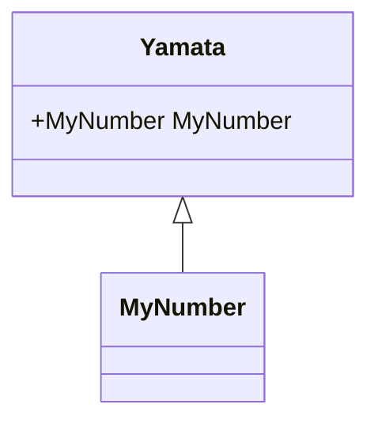
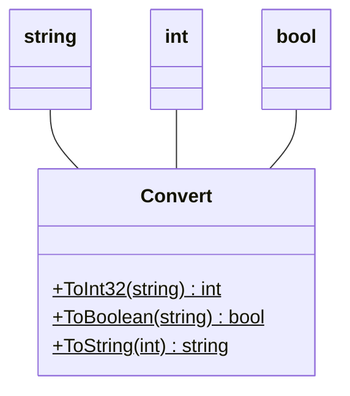
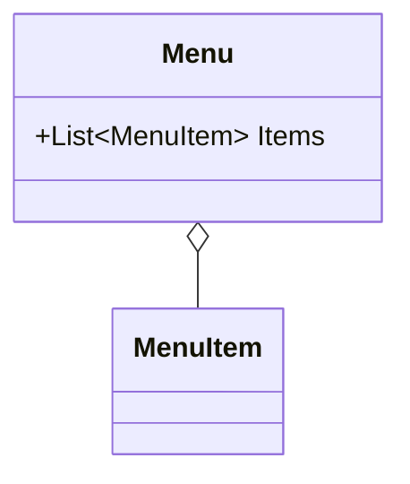
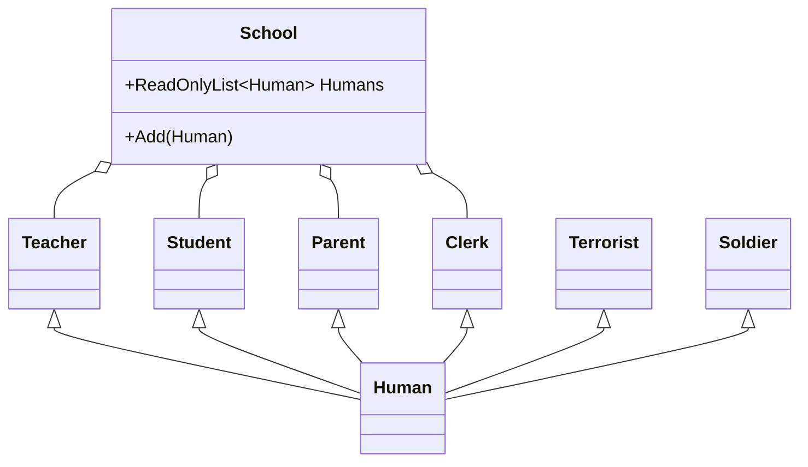

# 目次

これは連載「あすかの怪文書」の記事です。[目次はこちらからご覧になれます](https://zenn.dev/kmy/articles/asuka-cs-0-index)

# 言い訳

[オブジェクト指向概要](https://zenn.dev/kmy/articles/asuka-cs-1-0-summary)において、トランザクションスクリプトを批判しました。よってこの記事では、私の考えるオブジェクト指向におけるクラスの分け方について説明します。
この記事に登場する全ての文章の最後に「（笑）」を補完しながらお読みください。

# ドメインモデルを使用したプログラムに存在するクラス

ドメインモデルは、Eric Evans氏が2004年に出版したDomain-Driven Designという本に出てくる、DDD（ドメイン駆動開発）という考え方において出てくる言葉です。ここではDDDをベースに、ドメインモデルによるオブジェクト指向によく出てくるクラスや概念、それに対する私の理解を紹介します。

## エンティティ

おそらくドメイン駆動開発において最も重要になるクラスです。
エンティティは、モデルをオブジェクトとして表現します。状態と操作の両方を保持する、最も基本的なクラスです。多くの場合、ビジネスロジックはここに記述します。

エンティティは識別子を持ちます。ただし、識別子が可視化される必要はなく、１つのインスタンスがそのまま識別子となります。
例えば、ある１つの部屋に100人の山田さんがいるとします。100人の山田さんは、それぞれが独立したインスタンスを持ちます。

```cs
class Yamata
{
  public string FirstName { get; init; } = string.Empty;
  public int Age { get; init; }
  public Sex Sex { get; init; }

  public void PushButton()
  {
    Console.Write($"山田{this.FirstName}の頭 スイッチ・オン");
  }

  public void Sleep()
  {
    Console.Write($"山田{this.FirstName}は寝てしまった。情けない");
  }
}
```

### エンティティの同一性

このクラスのインスタンスは、山田さん１人につき１つ生成されます。例えば、同姓同名で年齢も性別も同じ山田さんがいたとしても、それらはインスタンスのアドレスによって識別されます。
以下のコードは常に`false`を返すべきです。なぜなら`yamata1`と`yamata2`はそれぞれ別のアドレス上に生成されたインスタンスであり、エンティティはそれを別人とみなすべきだからです。

```cs
var yamata1 = new Yamata { Name = "花子", };
var yamata2 = new Yamata { Name = "花子", };

// always false if Yamata is entity
var b = yamata1 == yamata2;
```

## 値オブジェクト

上の`Yamata`クラスでは、同姓同名の山田さんを区別する方法は、インスタンスのアドレスでの識別以外に方法はありません。C#では演算子すらオーバーライド可能であり、アドレスでの比較は少々心もとないように思えます。そこで、国の発行するマイナンバー情報を追加することにします。
マイナンバーは12桁から成る数字です。`int`では12桁には対応できないので、C#の型からの選択肢は`long`、`decimal`、`string`に限られます。しかしマイナンバーは大小の概念を持たず、また1〜11文字目は住民票コードから生成＋12文字目は検査用数字、という構成になっています。ここでは`string`にしたほうが都合がよいでしょう。

```cs
  public string MyNumber { get; init; } = string.Empty;
```

しかしこれには複数の問題が発生します。

* メモリ上のサイズは、`string`は12バイト、`long`は8バイトになります。プログラムでの扱いやすさは`string`にも分があるかもしれませんが、メモリの関係で後から`long`に変更する可能性もあります
* マイナンバーに関係するメソッド、例えばマイナンバーの整合性を検証するメソッドを追加したい時、`static`なサービスクラス（後述）を別途作成する必要が出てきます

したがって、これらの問題を解決するためにマイナンバーそのものを型として切り出すことにします。

```cs
readonly struct MyNumber
{
  public string Number { get; init; } = string.Empty;

  // GetHashCode, Equals, operator==
}
```

`Yamata`クラスにおいては、以下の参照を追加することになります。

```cs
  public MyNumber MyNumber { get; init; }
```

このように、私の考えではありますが、値の中でも以下のような場合は、`struct`など新しい型を作って切り出せば、保守性に貢献するでしょう。これを値オブジェクトといいます。

* `string`や`int`など既存の型で表現はできるものの、フォーマットやルールが決まっており他の変数と区別したい
* 複数の組み込み型によって1つの値を表現する（例：年、月、日の組み合わせによって日付を表現）
* 値そのものに関する操作を作成する可能性が高い

逆に、以下のものは値オブジェクトにすべきではありません。

* 変数への誤代入を防ぐのが唯一の目的である
  * 変数の数だけ機械的に値オブジェクトを作るのはプログラムを非常に冗長にさせます。それよりも変数に正確な命名をして区別すべきです
* エンティティのインスタンスを保持する
  * 場合にもよりますが、後述する同一性が確保できません
* 同一のデータが同一の値を表現しない
  * エンティティにしてください



値オブジェクトは、それ自体がメソッドを持つことが出来ます。値オブジェクトのインスタンスメソッドは、単なる`string`型として定義した場合と違い、その型を拡張させます。

```cs
class Yamata {
  public MyNumber MyNumber { get; init; }

  public bool Check()
  {
    return this.MyNumber.IsValid;
  }
}
```

### 値オブジェクトの同一性

制限事項として、値オブジェクトは、エンティティのようにオブジェクトのアドレスで識別されるべきではありません。

```cs
var num1 = new MyNumber { Number = "123456789012", };
var num2 = new MyNumber { Number = "123456789012", };

// always true if MyNumber is value object
var b = num1 == num2;
```

値オブジェクトはあくまで値を示すべきであり、同一性はただそのデータ内容によってのみ決まります。
値オブジェクトは可能であれば`Equals`メソッド、`GetHashCode`メソッド、`==`演算子のオーバーライドをあわせて実装すべきですが、それはプログラムを冗長にさせます。C# 10.0では`record struct`記法が[可能になるらしい](https://ufcpp.net/study/csharp/datatype/record/#record-struct)ので、そちらに期待しましょう。

値オブジェクトはその性質上、イミュータブルであることが好まれます。

## ドメインサービス

これ、ネットで調べていて出てきた言葉ですが、「Domain-Driven Design」という本には「ドメインサービス」という言葉は出てこないですね。「サービス」という言葉ならありますので、そっちを説明します。
クラス作りの基本は上のエンティティ、値オブジェクトになりますが、上では表現できない処理が出現する場合があります。

### C#フレームワークの例

例えば、C#における典型的な例として、数値を文字列に変換するメソッド`Convert.ToString`をはじめとして、ある型を別の型に変換するメソッドは`static`メソッドとして定義されることが非常に多いです。拡張メソッドも`static`メソッドの一種であり、さらに拡張メソッドを含むクラスは`static class`であることがコンパイラによって強制されます。
下記は拡張メソッドではありませんが、.NET Coreにて実装されている`static`メソッドの例です。

```cs
static class Convert { }

var text = Convert.ToString(3);
var isNotZero = Convert.ToBoolean(1);
var num = Convert.ToInt32("45");
```



これらのメソッドは2つの型を縦断しますが、インスタンスメソッドとして作ろうとすると、2つの型のうちどちらのメソッドとして含めるべきか判断に迷います。そもそも別の型への変換がクラスの責務に含まれないこともしばしばです。どちらの型に含めるか非常に曖昧な時は、型の変換を専門とする`static class`なサービスクラスを作っておいたほうが楽ですし、それぞれのクラスの責務を超えることもありません。

### 乱用厳禁

サービスは、一歩間違えるとトランザクションスクリプトを復活させます。理論上、すべてのビジネスロジックをエンティティ・値オブジェクトから剥奪して、サービスクラスにまとめることが可能です。しかしそのようなドメインモデルは必然的に貧血になります。
これを防ぐために、サービスクラスは一定の基準のもとで作成すべきです。「Domain-Driven Design」という本では、以下の基準が示されています。

> 1. 操作がドメインの概念に関係しており、その概念がエンティティや値オブジェクトの自然な一部ではない。
> 2. ドメインモデルの他の要素の観点からインタフェースが定義されている。
> 3. 操作に状態がない。
> 
> Eric Evans. エリック・エヴァンスのドメイン駆動設計 (Japanese Edition) (p.104). Kindle 版. 

私の考えとしては、基本的に、すべての機能はエンティティ・値オブジェクトのインスタンスメソッドとなることを前提に設計すべきです。それでは難しい場合、クラスメソッドにします。それでも駄目だった場合に、はじめてサービスクラスを作成します。サービスクラスもエンティティ・値オブジェクトと同様に責務を持つべきで、また特定のエンティティ・値オブジェクトとの関係性をあらかじめ明確にします。明確にすれば責務は自然とクラス名に反映されます。
また、サービスクラスが存在していても、エンティティ・値オブジェクトのインスタンスメソッドの作成で解決するようであれば、その解決手段を極力用います。

### シングルトンとの使い分け

:::message
この項目は世間一般の理解と真逆のことをプログラミング初心者が意味もなく主張しているものです。せめて寝る前に読まないでください
:::

シングルトンは、唯一のインスタンスを持つよう設計されたクラスのことです。その性質上、`static`クラスと同様に使うことが可能です。

世間一般の考え方では、シングルトンは状態を持たず、`static`クラスは状態を持つものと理解されています。私はその理由がよく分かりません。このような主張の出典がどこにあるかわからないので明確に反論することは出来ませんが、私は逆であるべきだと思っています。
なぜならシングルトンは、その気になれば複数のインスタンスを生成可能な通常のクラスとして再設計することが容易だからです。今後のリファクタリングを考慮すると、シングルトンは状態を持つべきではないかと思います。

ただ`static`クラスが100%必ず何が何でも状態を持つべきではないかと言うと、そうではありません。状態を持たないのは（私にとっては）理想ですが、どうしても状態を持たなければいけない時は持ってもいいと思います（サービスクラスの乱用可能性という観点から、私を含むオブジェクト指向初心者はまず`static`クラスを使わない方法を模索すべきです）。
私は、シングルトンは状態を持つことを前提としたクラス、`static`クラスは状態を持たないことを前提としたクラス、というふうに使い分けています。

また、`static`クラスよりシングルトンを選ぶ理由の1つとして、ポリモーフィズムが挙げられます。例えば何らかのフレームワークで、特定のインスタンスを実装したオブジェクトを作成する必要があるとき、`static`クラスはインターフェースを継承することが出来ないので、必然的にシングルトン一択になります。

#### シングルトンが状態を持つべきでないとされる理由（考察）

ただ、シングルトンは状態を持つべきではないと世間一般で言われる理由を、私の足りない頭で考察（笑）した結果、以下の理由があるのではないかという仮説を持ちました。リフレクションを用いた攻撃です。
通常シングルトンはアプリケーション全体を通して唯一のインスタンスを持つことを前提に設計されますが、リフレクションを使うと`private`なコンストラクタを呼び出すことで複数のインスタンスを生成することが可能です。攻撃者は複数のインスタンスが存在するというイレギュラーな状況を作ることで、シングルトンのインスタンスの設定を書き換えるなどして、アプリケーションを攻撃することが可能になります。
それから、シングルトンクラスはたいてい`sealed`で継承が禁止されるのがセオリーなのですが、`DispatchProxy`や`DynamicObject`を使えばこれすら突破して任意のコードを代わりにシングルトンインスタンスに設定することも可能になります。もうここまでくると状態関係なくなっちゃうかもしれませんが。
一方で`static`クラスは、複数インスタンスの生成禁止が文法レベルで定められており、リフレクションでインスタンス生成による攻撃ができないため、これらの攻撃を防ぐことが出来ます。

# クラスをまとめる概念

複数のインスタンスは、時にデータベースなどでまとめて保存される必要があります。また、`List<T>`、`Collection<T>`などのように、配列やリストにまとめるのも選択肢です。
このページの趣旨と少し外れるので、簡単に説明します。~~シングルトンの話ェ~~

## 集約

データの集まりの概念です。何かを集約するクラスは、他のクラスのインスタンスをメンバーとして持ちます。



あるインスタンスが集約するインスタンスは、一つのルールに基づいて制約条件を持たなければいけません。例えば1つの学校に入ることができる人間は、教師、生徒、用務員、保護者のみです。不審者は学校に入ってはいけません。



この例では、`Add`メソッドによってのみ`School`に`Human`を追加することが出来ます。他の手段で`Human`を追加することは出来ません。`Add`メソッドでは、`Teacher`、`Student`、`Parent`、`Clerk`の追加のみ許可し、そうでないものは追加しません。
よって、`Terrorist`や`Soldier`を`School`に追加することは不可能です。これによって`School`クラスの持つデータの整合性が確保されます。データの整合性を保つことは重要な考え方ですので、このことは後続の複数の記事でも詳しく説明します。

## ファクトリ

あるインスタンスを生成するためのクラスです。
インスタンスの生成のために複雑な処理を行う必要がある場合に、最低限の情報だけをファクトリクラスに渡せばあとはファクトリクラスがなんとかしてくれる、というふうな理解でいいかなと。以下は最低限の例です。

```cs
record Human(string Name, int Age, Sex sex, DateTime birthDay, string groupName);

class GroupMemberFactory
{
  public string GroupName { get; init; } = string.Empty;

  public Human CreateMale(string name, DateTime birthDay)
  {
    var age = (DateTime.Now - birthDay).TotalDays / 365;
    return new(name, age, Sex.Male, birthDay, this.GroupName);
  }
}

class Program
{
  public void Main()
  {
    var factory = new GroupMemberFactory
    {
      GroupName = "中核派",
    };
    var male = factory.CreateMale("山田", new DateTime(1990, 3, 31));
  }
}
```

:::message
Visual Studio CodeもZennのハイライティングもC# 9に対応してないのつらぽよ
:::

## リポジトリ

データベースやファイルなどからデータを取り込んでクラスのインスタンス化するやつです。EntityFrameworkとかこれですね。
データベースに限らず、クラウドからデータを取得する場合、REST APIから取得する場合などもこれにあてはまります。所定のフォーマットに従った非オブジェクトを、アプリケーション内のプログラムで扱うオブジェクトに変換することで、オブジェクト指向的なプログラミングに利用可能なパーツとして提供します。
あとあと、リポジトリパターンなんてのもあります。

# その他の概念

## モジュール

クラスは、モジュール単位で分けられます。C#ではアセンブリ（Visual Studioプロジェクト）単位で区別されます。
モジュールは一般に、呼び出し側が細かいことを気にしなくても呼び出せるよう振る舞います。細かい処理を全てモジュールの中に隠します。そのため、良質な設計上であっても、外部に公開するインターフェース（クラス、メソッド、プロパティなど）は必要最小限になる一方で、モジュール内部では大量の密結合が発生する傾向にあります。

Javaではクラスやメソッドに`default`というアクセス修飾子があり、ひとつのプロジェクト内でも名前空間単位で処理をカプセル化することが可能でしたが、C#ではそのようなことはできないので、文法的に完全にカプセル化したいなら、内部クラスを作るか、新しいDLLプロジェクトを作成するか、諦めて全部`public`にするか、くらいだと思います。
その代わり、C#ではJavaにない`internal`、`protected internal`、`private protected`の3つのアクセス修飾子を使用して、Javaより細かくモジュール内の処理をカプセル化することが可能です。

## ドメインイベント

ドメインイベントとは何でしょうか？
調べてもよくわからなかったのでここでは代わりにC#にある`event`の説明をします。そもそも「ドメインイベント」という言葉自体、少なくとも「Domain-Driven Design」という本の翻訳本に出てくる言葉ではありません。「イベント」です。

:::message
ドメインイベントは「Domain-Driven Design」の節の１つとして立項されているわけではありませんが、他のサイトで「エンティティ」「値オブジェクト」「ドメインサービス」と並んで「ドメインイベント」がリストアップされることが多いので、ここでも併せて紹介します。
:::

「Domain-Driven Design」はJavaをベースに説明されています。Javaでは、C#の`event`に相当するものはなく、代わりに`Listener`を実装した匿名クラスを使いますが、イベントに処理を追加する・削除するという処理は自前で実装する必要があります。
簡単なイベントであれば別途クラスを作る必要のないC#って便利ですね。C#では自作した`delegate`を用いて`event`を作ることも出来ますが、それはCOMや既存のライブラリにイベントを設定する場合のみに使いました。たいていは`EventHandler`で事足ります。

```cs
class EventTest
{
  public event EventHandler? Detected;

  public void Input(bool value)
  {
    if (value)
    {
      this.Detected?.Invoke(this, EventArgs.Empty);
    }
  }
}

class Program
{
  public static void Main()
  {
    var obj = new EventTest();
    obj.Detected += OnDetected;  // start listening event
    obj.Input(false);
    obj.Input(false);
    obj.Input(true);  // fire Detected event
  }

  private static void OnDetected(object sender, EventArgs args)
  {
    Console.Write("Detectedイベントが発行されました");
  }
}
```

オブジェクトは任意のイベントを**発行**することが出来ます。そのオブジェクト自身または別のオブジェクトはそれを**購読**することでイベントを受け取り、処理を行うことが出来ます。イベントは一見無関係な複数のオブジェクトを接続します。UIでボタンをクリックした時に発行されるイベントで何らかの処理を行うのが、イベントの典型的な例です。それ以外にも、モデルがイベントを発行した時に別のモデルで処理を行わせることも可能です。イベントは、オブジェクトの状態の更新を表します。
ただしイベントは特定可能な一意のものであるべきです。例えば学校へ登校するイベント、下校するイベントを同時に発行すべきではありません。また、例外はありますが、通常は中身が全く同じイベントを複数回連続して発行することを避けるべきです。

# 目次

これは連載「あすかの怪文書」の記事です。[目次はこちらからご覧になれます](https://zenn.dev/kmy/articles/asuka-cs-0-index)
