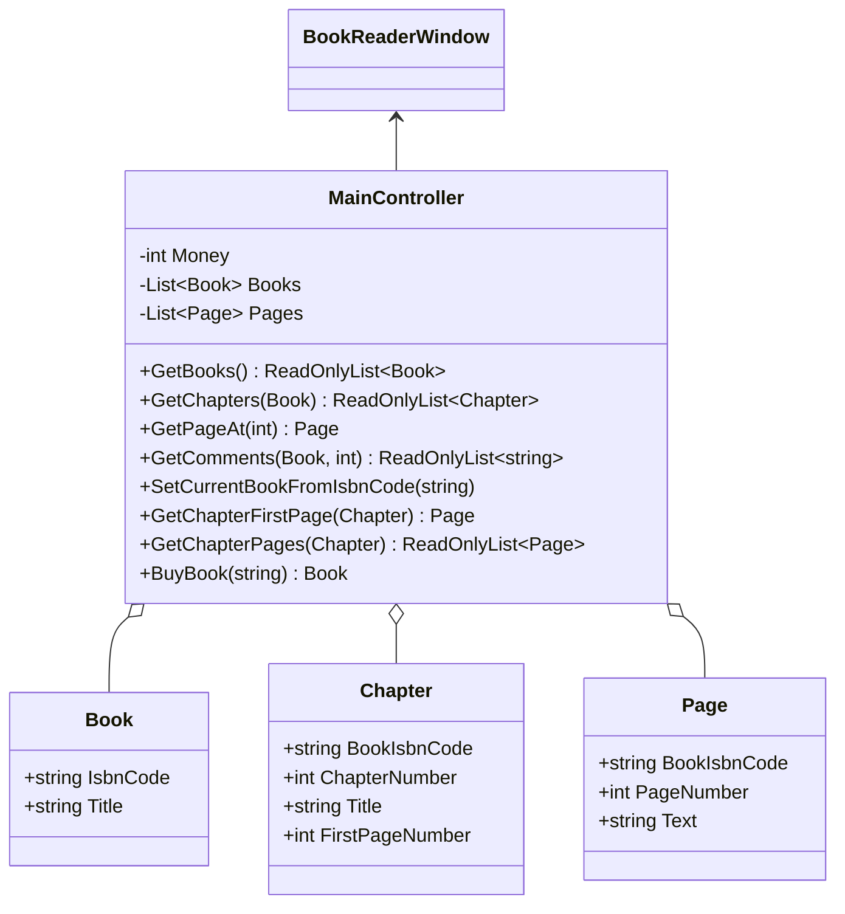
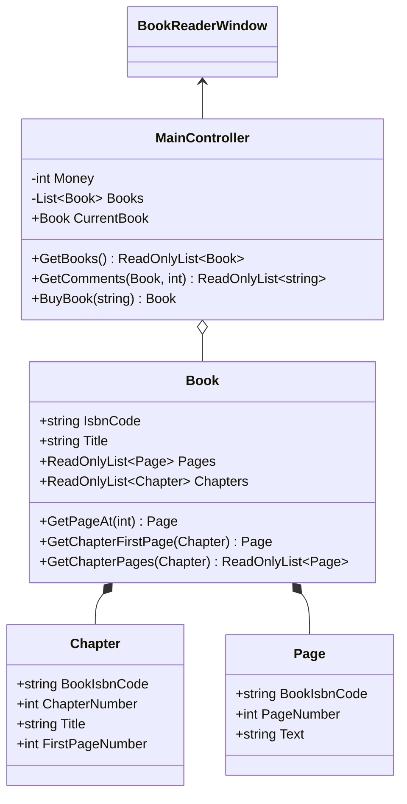
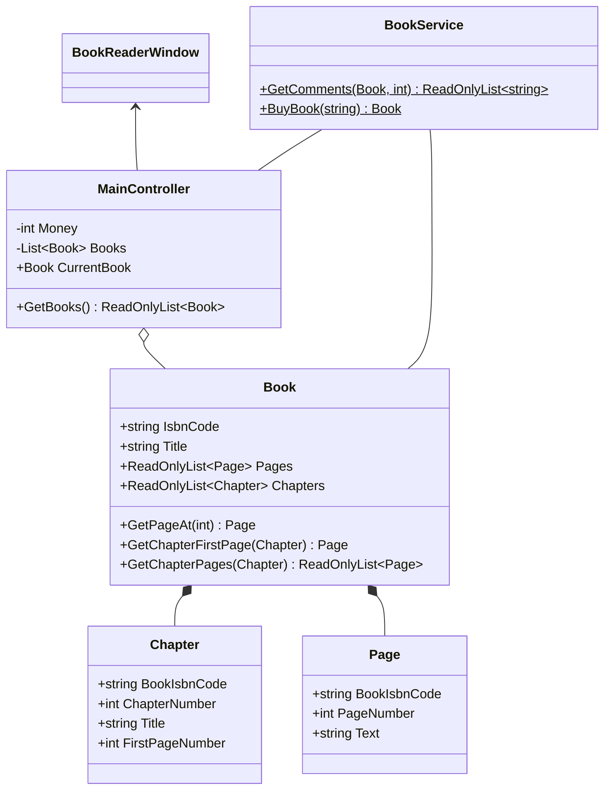
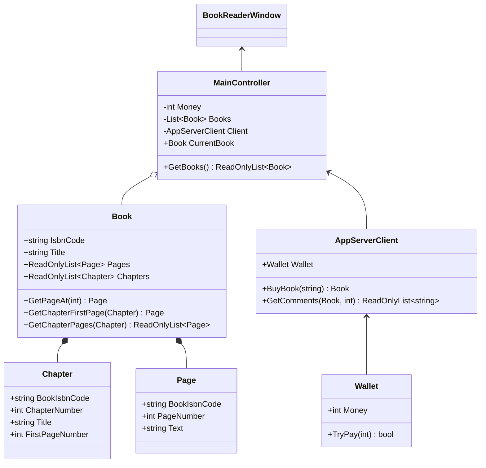
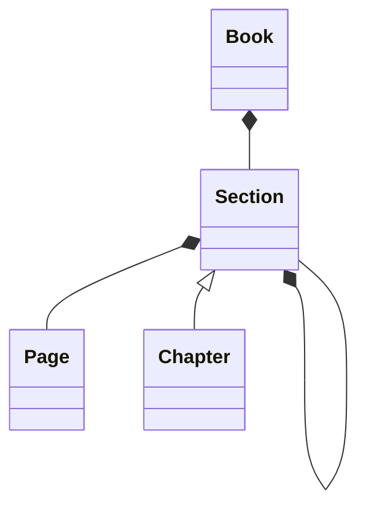

# 目次

これは連載「あすかの怪文書」の記事です。[目次はこちらからご覧になれます](https://zenn.dev/kmy/articles/asuka-cs-0-index)

# 言い訳

前提条件として、私はオブジェクト指向を全く理解していません。全くと言っていいほど理解していません。アンパンマンが自分の頭の中に入っているあんをつぶあんなのかこしあんなのか知っていないのと一緒です。なのでこの記事にはでたらめしか書かれていません。
外国人は日本語を学ぶ目的でこの記事を読まないでください。この記事は日本語の学習に向いていません。

:::message alert
あんはつぶあんであるべきです。こしあんは邪悪であり、人類の敵です。火星人もそう言っていました
:::

# 「もの」に基づくクラス設計

オブジェクト指向の初心者は、往々にして、「もの」を基準にクラスを設計します。ここでの「もの」とは、以下のようなものをさします。

* 画面
  * 1つの画面につき1つのクラス
  * コントローラクラスもこれに含まれる（別途作る場合もある）
* データベースのテーブルに対応するクラス
  * 場合によってはDAOパターンに基づくクラスを作ることも
* ユーティリティクラス

これらをなぜここで「もの」と表現しているかと言うと、すべて仕様書で可視化された概念だからです。
これらのクラス分けはドメインモデルにおいても間違いではありませんが、特筆すべきは、開発者がこのクラスの中で処理を完結させようとする点です。開発者は、上記以外のクラスを作ることを嫌います。なぜなら仕様書に書いていない概念を勝手に作ることができないからですし、その概念の必要性もないと判断しています。結果として、以下のようなクラスができあがります。
これは、ブックリーダーアプリの実装例です。仕様書では、「メインウィンドウ」「本」「チャプター（章）」「ページ」の４つの概念が記述されています。

| 仕様書の種類 | 書かれている「もの」 |
| --- | --- |
| 画面仕様書 | メインウィンドウ |
| テーブル仕様書 | 本、チャプター、ページ |

:::message
いやしかしクラス図ダイアグラムは文字が小さいですね。読めなければお手数ですがGitHubのコードを読んでください
:::

この構成には複数の問題があります。まず、[私のDDDに関する残念な理解](https://zenn.dev/kmy/articles/asuka-cs-1-1-ddd)の記事でも述べたとおり、これはトランザクションスクリプトであり、`Book`、`Chapter`、`Page`クラスは貧血ドメインモデルになっています。操作をすべて`MainController`クラスに集約してしまったためです。これは私が職場で経験した、MVCプログラムでよく見る失敗例です。
しかしこれは話の本筋ではないので、ささっと修正しましょう。

いくつかの`Get`で始まるメソッドをプロパティに変更しましたが、本来`Book`クラスに含めるべきだったロジックが`MainController`から移管されて、すっきりしたと思います。また、`Chapter`や`Page`も、`Book`が直接持つようにすることで、DDDの集約を表現しやすくなりました。

## 可視化されたもののみをオブジェクト化する限界

ところで、`MainController`にはまだロジックが残っています。

* 本を購入する処理
* 本の読者のコメントをサーバーから取得する処理

前提として、これらの処理は、本に関する情報を取得する他のメソッドと同様、コントローラクラスに含めるべきではありません。ドメインモデル設計において、適切なモデルクラスに移動させなければいけません。**どこへ？**
一番の候補として、`Book`クラスが挙げられます。なぜならどちらも、一応は「本」に関係する処理だからです。しかしこれには、問題があります。それぞれ、詳しく見ていきます。

### 本を購入する処理

これを`Book`クラスに含める場合、以下の処理も付随して`Book`クラスに入ってきます。

* 現在の所持金の保持
* 本を購入して、新しい`Book`インスタンスを取得する

問題点は、「新しい`Book`をネットから取得する」という処理が`Book`クラスの中で行われていること。また、お金の管理を`Book`クラスが行っていることです。これは、拡張において、以下の問題をはらみます。

* このアプリが今後、本だけでなく音楽も扱うようになったら、同じような購入処理を`Music`クラス内にコピペするの？
* 所持金のチェック、入金なども`Book`クラスの中でやるの？本関係なくない？
* 購入時のインターネット接続処理を修正したい時に`Book`クラスを触るの？ネット接続触るのになぜ`Book`？本関係なくない？

### 本の読者のコメントをサーバーから取得する処理

本を読んだ読者の感想、コメントなどをサーバーから取得する処理です。これも`Book`クラス内に処理を記述することになります。

* 購入処理に伴うインターネット接続処理を使い回せないの？
* ネット接続なのになぜ`Book`ｒｙ
* `Music`のコメントを取得したい時もコピペするの？

### 一応の解決策

上記処理を無理に`Book`クラスに押し込むことは、プログラムの拡張性を損ないます。もちろんブックリーダーアプリに音楽購入・鑑賞機能をつけるのは、当初の予定にも仕様書にも記述されていないことでしょう。今回はひとつの分かりやすい例として挙げましたが、実際はもっとこまこました要求が多いはずです。ただ、上記のプログラムは、そのような拡張すら難しい構造になっています。
ここでは、一応の解決策としてサービスクラスを作成して対応します。

しかし、サービスクラスに含める処理は最小限にしたいというのが理想です。このサービスクラスを何とか減量できないものでしょうか。

# 責務に基づくクラス設計

責務とは、Responsibilityの和訳として、オブジェクト指向のクラスの分け方としてたびたび引き合いに出される言葉です。
私は正直、責務とは何であるかを全く理解していません。責務について調べましたが、頭の悪い私は正直言って、責務のことを正確に理解していない自信があります。代わりに、私は責務を以下のように言い換えています。

* このクラスは、周囲からどのような**期待**をされているか？
  * どのような情報を取得できることが**期待**されているか？
  * どのような処理を行うことが**期待**されているか？
  * 逆に、何が**期待**されて**いない**のか？
* 期待を満たすために、どのようなデータを持つべきか？

[オブジェクト指向の概要](https://zenn.dev/kmy/articles/asuka-cs-1-0-summary)でも説明したとおり、クラスはある処理をカプセル化した部品です。部品を扱うとき、呼び出し側はこのクラスに何を入力して何を出力するか知っていればよい、と書きました。クラスは単一の明確な役割を持っているべきであり、またその役割は周囲に対して説明可能でなければいけません。かつ、その役割から外れたことをすべきではありません。

## 「もの」で設計したクラスの問題点

この考えに照らし合わせて、これまで作ったクラスを検証します。
問題となった`Book`クラスは、以下の責務を持っているものと考えられます。

* 持っている情報：本のページ、チャプター
* 可能な処理：本の情報を引き出す、本に関係するデータを操作する

さて、今回問題になった処理を振り返ります。

* 本を購入する処理
* 本の読者のコメントをサーバーから取得する処理

### 本を購入する処理

このメソッドは、インターネット接続処理、お金管理処理を通して、戻り値として本を返します。本は単なる戻り値に過ぎず、それに至るまでの処理は本とは関係なく、上述した本の責務から外れることは明らかです。
少しでも本が関係するからと言って、このようなメソッドを安易に`Book`クラスに含めると、前述したとおり拡張の観点から問題が発生します。これは、以下のクラスを作成して対処すべきです。

* お金を管理するクラス`Wallet`
* インターネット接続処理（ここではREST API呼び出し）をおこなうクライアント`AppServerClient`

:::message
現実的な設計では、REST APIを通した本の購入処理の戻り値は、購入結果（購入が成功したかどうか）です。購入した本を取得する処理は別途作ります。こうなると購入処理ってますます本関係ないですね
:::

### 本の読者のコメントをサーバーから取得する処理

これも同じく、インターネット接続処理が要求されます。これも本の責務からは外れます。
しかし、新規に記述するコードはほとんどありません。なぜなら本の購入処理の時に作成した`AppServerClient`にちょっと機能を追加するだけで事足りるからです。

### 設計は常に仕様書を超える

むろん、これらのクラスは仕様書には含まれていません。プログラム側で必要になったから、勝手に作ったクラスです。
仕様書通りにクラスを作ることは、間違いではありません。そのようなクラスは、仕様書に対応したインターフェースであり、仕様書からプログラムを理解するための入り口にすぎません。仕様書を偏重し、仕様書にあるクラスしか作ろうとしないことが問題なのです。これは「もの」をベースとしたクラス設計のときに必ず発生する欠陥です。

しかし実際のところ、どのようなクラスを作ればいいかの知識が、ほぼプログラマのこれまでの経験に依存することも問題です。同じ仕様書から、プログラマの数だけ多種多様な設計が生まれる以上、コードの品質はプログラマ個人の知識や経験の差に大きく依存します。これらはどうしても個人が努力しなければいけないポイントです。ちなみに私の設計は壊滅的なので参考にならないというのは既知の事実です。

それはともかくとして、この変更により`static`メソッドが消えました。

:::message
ここで操作のないクラスが２つ（`Chapter`、`Page`）ありますが、今回の定義に従うと責務は適切であると考えます。なぜなら、それらのクラスには操作を持つ余地が残されており、かつ他のどのメソッドもこのクラスの操作にすることは不適切であるからです。
１つのクラスが必ず状態・操作を両方持たなければいけないわけではなく、両方持たせることを目的化してはいけません。今回は、本には`Chapter`の存在しないページ（遊び、目次、奥付など）があるという仮説に基づいて、`Chapter`と`Page`をお互いに結びつきのないクラスとして設計しました。
どうしても気になるのであれば、`Page`クラス、`Chapter`クラスに`Book`インスタンスへの参照を持たせる設計もよいでしょう。ただしその場合、きれいな階層設計にならないこと、整合性を取る処理が別途要求されることには注意が必要です。代わりに`Chapter`クラスをサブクラスに持つ`Section`クラスを作り、`Page`を保持するクラスは`Section`のみとし、`Book`には`Section`のリストのみを持たせるというのもひとつの手です

:::

## クラスを責務で分割するメリット

ひとことで言うと、プログラムの拡張性、保守性の向上に貢献します。

この説明は、SOLID原則の１つである「単一責任の原則」とかぶりますが、責務に基づいてクラスを適切に分割することの本質は、修正時の影響範囲を最低限にすることにあります。

> 1つのクラスは1つだけの責任を持たなければならない。すなわち、ソフトウェアの仕様の一部分を変更したときには、それにより影響を受ける仕様は、そのクラスの仕様でなければならない。
> ウィキペディア「SOLID」

などと書かれていますが、「クラスを変更する理由は唯一であるべき」と言い換えたほうが分かりやすいかもしれません。例えば、以下のようになるようにクラスを設計すべきです。

* 本の仕様を変更する時に、`Chapter`クラスや`Page`クラスは変更してはいけません。`Book`クラスのみを変更すべきです
* インターネット接続処理の修正（例：REST APIのURL）など、本に関係ない理由で`Book`クラスを変更すべきではありません

:::message
というのは理想ですが‥‥まあ、理想通りになるよう最大限努力しましょう。諦めてはいけません
:::

これを実現するための最適な手段が、クラスに単一の責務を持たせるということです。

# 目次

これは連載「あすかの怪文書」の記事です。[目次はこちらからご覧になれます](https://zenn.dev/kmy/articles/asuka-cs-0-index)
