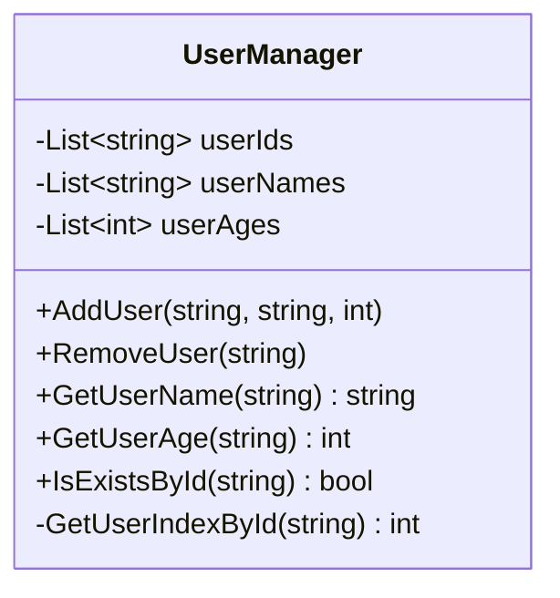
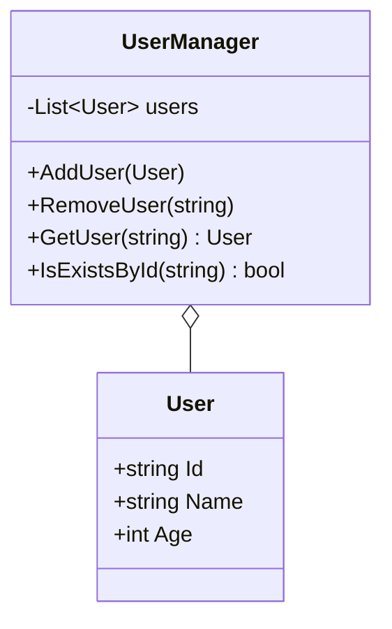
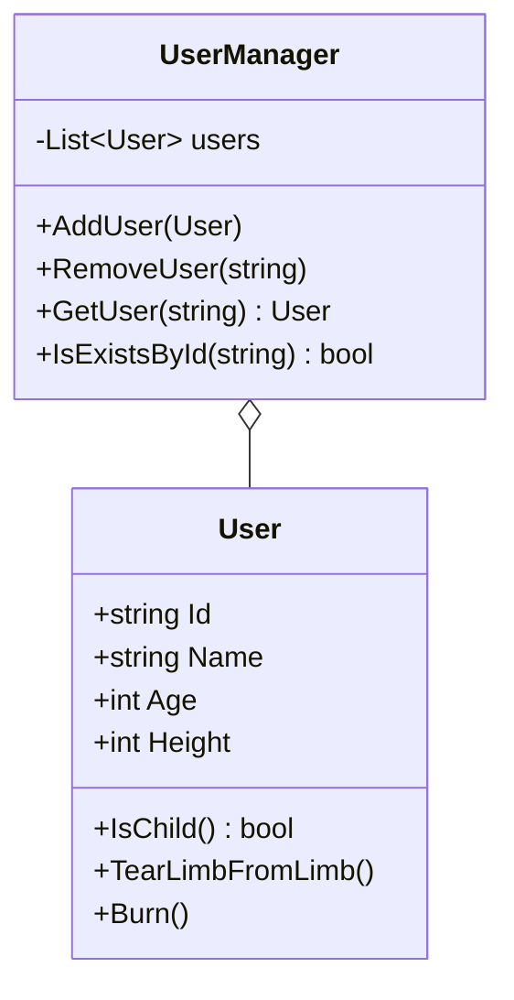

# 目次

これは連載「あすかの怪文書」の記事です。[目次はこちらからご覧になれます](https://zenn.dev/kmy/articles/asuka-cs-0-index)

# 言い訳

本連載はこの記事のように、問題解決型の記事がメインになります。まず問題となるコードを掲示し、なぜそれが問題なのかを検証して、私の意見を述べる形式で進行します。ただし全ての記事がこうであるとは限りません。
本記事は、[素人によるDDDにありがちな誤解](https://zenn.dev/kmy/articles/asuka-cs-1-1-ddd)で説明した「値オブジェクト」の説明も部分的に含まれます。

## 組み込み型とは？

C#における用語です。`int`、`short`、`string`など、C#において構造体名とは別にエイリアス名が存在する型を、本連載ではこのように呼称します。
Javaでは同様のものが「プリミティブ型」と呼ばれていますが、こちらはJavaにおいてはオブジェクトとして扱われません。Javaは完全なオブジェクト指向言語ではないと言われるゆえんです。それと区別するために、C#でのそれは組み込み型と呼称することにします。

# 問題

まず、ユーザーを管理するコードがあるとします。
このコードは一見、正常に動作します。

```cs
class UserManager
{
  private readonly List<string> userIds = new();
  private readonly List<string> userNames = new();
  private readonly List<int> userAges = new();

  public void AddUser(string id, string name, int age)
  {
    this.userIds.Add(id);
    this.userNames.Add(name);
    this.userAges.Add(age);
  }

  public void RemoveUser(string id)
  {
    var index = this.GetUserIndexById(id);
    if (index >= 0)
    {
      this.userIds.RemoveAt(index);
      this.userNames.RemoveAt(index);
      this.userAges.RemoveAt(index);
    }
  }

  public string GetUserName(string id)
  {
    var index = this.GetUserIndexById(id);
    if (index >= 0)
    {
      return this.userNames[index];
    }
    throw new IndexOutOfRangeException();
  }

  public int GetUserAge(string id)
  {
    var index = this.GetUserIndexById(id);
    if (index >= 0)
    {
      return this.userAges[index];
    }
    throw new IndexOutOfRangeException();
  }

  public bool IsExistsById(string id)
  {
    return this.GetUserIndexById(id) >= 0;
  }

  private int GetUserIndexById(string id)
  {
    return this.userIds.IndexOf(id);
  }
}
```



## どこが問題？

このクラスの特筆すべきところは、ユーザー情報を`userIds`、`userNames`、`userAges`の３つのリストに分けて格納しているところです。そして、それらのリストはすべて組み込み型を格納します。
このコードの欠点、デメリットは、３つのリストの間に依存関係が発生していることです。３つのリストには、以下のルールが発生しています。

* ３つのリストの同一インデックスに、同一ユーザーの情報を格納する
* ３つのリストは全て同じサイズでなければならない

クラス内の`private`なフィールド変数の間に依存が発生することを全て否定するわけではありません。経験の浅い私がどう頑張っても、フィールド間での依存関係というのはどうしても避けられません。しかし、このような暗黙のルールは文法的な誤りではなく、コンパイラによる制約を受けません。コンパイラの制約を受けないものはプログラマが手動でチェックする必要があることを忘れないでください。

これは、オブジェクト指向の誤りに起因すると考えます。今回保持しているのはユーザーデータの中身ですが、これを`UserManager`が直接保持することは、責務の観点から不適切です。`UserManager`はユーザーという集約の管理と、個別のユーザー情報のきめ細かい管理という２つの責務を負っています。さらに、所定のルールに従って３つのリストを保持することは、それらの管理および整合性の確保が別途必要になるということです。これも加えると、責務は３つになります。これらは性質の異なる処理であり、別々のクラスに分割すべきです。
ただし後述するとおり、実際に分割されるクラスは３つではなく２つです。これは、本来ひとつの塊として結びつけるべきデータをばらばらにしてしまったことが原因で、それらを結合するための本来不要な責務が発生したことによります。適切なリファクタリングは、責務の絶対数すら減らし得て、コードをシンプルにします。

理論だけを長々と書いても分かりづらいと思いますので、結果として何が起きるかを具体的に示しましょう。コンパイラに頼らずプログラマが手動で整合性を保たなければいけないプログラムは、保守性を低下させます。例えば、ユーザーの情報に「身長」を追加します。以下のコードは正常にコンパイルされます。

```cs
class UserManager
{
  private readonly List<string> userIds = new();
  private readonly List<string> userNames = new();
  private readonly List<int> userAges = new();
  private readonly List<int> userHeights = new();

  public void AddUser(string id, string name, int age, int height)
  {
    this.userIds.Add(id);
    this.userNames.Add(name);
    this.userAges.Add(age);
    this.userHeights.Add(height);
  }

  public void RemoveUser(string id)
  {
    var index = this.GetUserIndexById(id);
    if (index >= 0)
    {
      this.userIds.RemoveAt(index);
      this.userNames.RemoveAt(index);
      this.userAges.RemoveAt(index);
    }
  }

  // ...
}
```

これを実行すると、ユーザー追加は正常に動作します。しかし、ユーザーを削除するときに身長の情報が削除されないため、データに矛盾が発生します。身長情報を追加したプログラマは、これらの暗黙の依存関係を完全に把握しきれていないか、把握していたとしてもプログラムコードを書き忘れていました。厄介なことに、このコードは正常にコンパイルできる上に、途中までは正常に動作するので、ミスに気づくのは難しいです。
適切に設計しても、このようなケースが発生することはよくあります。だからこそ、依存関係による整合性の複雑化は最低限にするよう努めるべきです。

## アプローチ

今回の場合、以下のようにリファクタリングすることで、フィールド間の依存関係を解消することが出来ます。

```cs
class UserManager
{
  private readonly Dictionary<string, User> users = new();

  public void AddUser(User user)
  {
    this.users.Add(user.Id, user);
  }

  public void RemoveUser(string id)
  {
    this.users.Remove(id);
  }

  public User GetUser(string id)
  {
    return this.users[id];
  }

  public bool IsExistsById(string id)
  {
    return this.users.ContainsKey(id);
  }
}

class User
{
  public string Id { get; init; }
  public string Name { get; set; }
  public int Age { get; set; }
}
```



これは、３つのリストを`UserManager`から切り出し、１つのクラスにしています。これによって３つのデータ`Id`、`Name`、`Age`がお互いに結びつき、複数のリストの整合性をとる必要がなくなり、管理が容易になりました。これは新しいデータ構造をクラスという形で定義しています。その構造はプログラマによるカスタム定義ではなくC#の文法によって保証されているため、データの整合性維持という責務から`UserManager`を解放します。
さらにもとのコードにあった`GetUserName`、`GetUserAge`メソッドは不要になりました。なぜなら個別のユーザーデータの詳細を保持する`User`クラスの`Name`プロパティ、`Age`プロパティによって提供されるからです。呼び出し側は、以下のコードによって、従来通りこれらの情報にアクセスできます。

```cs
var manager = new UserManager();

// ...

var user = manager.GetUser("123456");
var userName = user.Name;
var age = user.Age;
```

これまでユーザー情報は`UserManager`クラスの情報の一部として提供されてきました。それらの情報を１つのインスタンス変数にまとめることは、プログラムをコンパクトにします。

またこれは保守性だけでなく、拡張性の向上にも貢献します。例えば、上記したようなプロパティ追加のほか、`User`クラスに操作を追加するときも`UserManager`クラスの修正を必要としません。



# まとめ

さて、ここで問題のコードについて振り返ります。
コード自体は、残念ながら、私がこれまで会社で何度も見てきたものです。新しい型を作ろうとせず、組み込み型ですべてを表現しようとするプログラマが多いと感じています。

確かに人名、年齢、身長は既存の組み込み型で表現できるものです。さらに言うと、C#に存在するすべての型は、もとを辿ればほとんどが組み込み型（またはデリゲート、COMオブジェクトなど）で構成されているのではないかと思います。組み込み型は便利ではありますが、`int`の場合は「数値」、`string`の場合は「文字列」を表している物理的な型にすぎず、そこに意味は存在しません。組み込み型によって意味あるデータが生まれるのであれば、それは積極的に型として定義すべきです。データに意味をもたせることで、それぞれのクラスの責務が明らかになります。

従来のプログラマも当然、複数の組み込み型の組み合わせが意味を持つことを理解しています。しかし、「意味をルールにする」ことと「意味を型にする」ことの違いを理解していません。ルールは人の手で修正しなければいけません。反面、型になった瞬間にコンパイラによる型チェックの恩恵を受けることが出来、プログラムの保守性向上に繋がります。
第２章でも詳しく述べますが、プログラムの保守性・拡張性を確保するためには、コンパイラの利点を最大限享受すべきです。そのためには、まず「データを意味を持った塊にする」ことの重要性を理解し、クラスの責務範囲を明確にしてください。

# 目次

これは連載「あすかの怪文書」の記事です。[目次はこちらからご覧になれます](https://zenn.dev/kmy/articles/asuka-cs-0-index)
