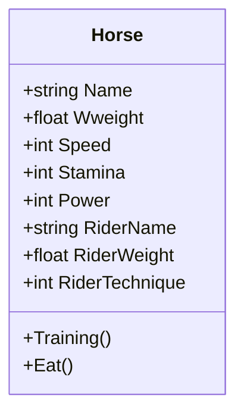

# 目次

これは連載「あすかの怪文書」の記事です。[目次はこちらからご覧になれます](https://zenn.dev/kmy/articles/asuka-cs-0-index)

# 言い訳

型は責務を持つと、[初心者による虚構と誤解にまみれたDDDの説明](https://zenn.dev/kmy/articles/asuka-cs-1-1-ddd)で述べました。ここでは、１つの型に複数の責務を持たせてはいけないという考え方を詳しく掘り下げます。これは、SOLID原則の単一責任の原則（SRP）に深く関係します。
世間には「神クラス(God class)」という言葉があります。１つのクラスに大量のコードを詰め込んだ結果、コードの見通しが悪くなったクラスを言います。単一責任の原則は、１つのクラスを修正する理由を１つにすることを目的とし、神クラスの誕生を未然に防ぎます。

# 問題

競馬シミュレーションゲームを制作します。ここで、競走馬をあらわす`Horse`クラスを作成しました。
このクラスの問題点は何でしょうか？

```cs
class Horse
{
  public string Name { get; }

  public float Weight { get; private set; }

  public int Speed { get; private set; }

  public int Stamina { get; private set; }

  public int Power { get; private set; }

  public string RiderName { get; private set; }

  public float RiderWeight { get; private set; }

  public int RiderTechnique { get; private set; }

  public void Training()
  {
    // ...
  }

  public void Eat()
  {
    // ...
  }
}
```



## どこが問題？

このクラスは名前`Horse`にあらわれているとおり、本来の責務は以下であるべきです。

* 馬個体の情報を格納、馬に対する操作をおこなう

しかし、実際のクラスでは以下の２つの責務が入れられています。

* 馬
* 騎手

馬のステータスは確かに入っていますし、それがこのクラスのプロパティの大部分です。しかし、そこに騎手のデータが混じっています。これは、操作の呼び出しを複雑にします。

```cs
// 馬と騎手のどっちが食べる？
horse.Eat();

// 馬と騎手のどっちがトレーニングする？
horse.Training();
```

むろん、コードだけ読めば上の答えはいずれも馬です。しかし、それは「周囲がこのクラスに期待すること」であって、実装内容によっては実際の動作とは異なる場合があります。
実際にこのクラスのインターフェースを読んだプログラマは、`Horse`クラスの責務について深く考えず「このクラスには騎手のデータも入っているから、騎手の体重も増えるだろう」と誤って解釈するかもしれません。その結果、操作の主語や目的語が曖昧になり、馬に対する`Eat`メソッドで騎手の体重が増えることになりかねません。これは周囲の想定から外れた挙動であり、バグのもとになります。

```cs
  public void Eat()
  {
    this.Weight += 1;
    this.RiderWeight += 0.1f;
  }
```

今回は単純な例だからまだいいものの、責務と実装が食い違う状態を放置すると変数や操作の混合が起き、このような危険性をはらみます。
さらに懸念されるのは、クラスの責務など考えず「そこに変数があるから使う」というプログラマが意外と多いことです。これに関して、一概にプログラマに非があると言うのは間違っています。このプログラムを初めて読むプログラマ（時にはプログラムの続きを書かないまま１ヶ月以上放置していたあなた自身も含まれます）は、このクラスの仕様を明確に理解しないまま「`Eat`メソッドを実装して」と言われたら、大抵は**リファクタリングしないまま**コードを記述すると考えます。なぜならそのほうが手軽だからです。ときには、そこに`RiderWeight`プロパティが存在することを当たり前と考え、疑問を持たないかもしれません。リファクタリングのためにはクラスの仕様やクラスを呼び出す他のクラスの仕様を十分に理解する必要があるため、単純に実装するよりも遥かに多くの時間を要します。

あなたは「そんなばかな」と考えるでしょう。それはこの例がきわめて単純だからです。さらに複雑なコードでは、 以下のような典型的な問題が発生します。

### 大量のフィールド変数やプロパティ、メソッドがあるだけでなく、お互いを混合して使用する

１つのクラスが複数の責務を請け負うことは、メンバー同士の結合度を下げます。責務Aにはフィールド変数A、責務Bにはフィールド変数B、責務Cにはフィールド変数C、というように使い分けるようになります。１つのクラスに複数の責務を混合することによって、クラスの肥大化とともに参照できる情報が増え、以下の問題が発生します。

* どのメソッドでどのフィールド変数が使われるか、ばっと見て分かりづらい（可読性の低下）
* 間違って無関係のフィールド変数、メソッドを使ってしまう（保守性の低下）
* 呼び出し側もどのメソッドを呼び出せばいいのか分からない（可読性の低下）
* コードを書く時、どの変数やメソッドが適切かその都度調べるなどするため、記述時間が増える（拡張性の低下）

## アプローチ

適切に設計されたクラスであっても、規模が大きくなるほどクラスの肥大化による問題は発生します。しかし、適切ではない設計によるクラスで問題が起きる確率は、非常に高いです。クラスが複雑になり、可読性・保守性・拡張性が低下したと感じたら、まずクラスの設計に問題がないか検討すべきです。また、適切な設計であっても、責務をさらに細かく分割できないか検討することは、問題の改善につながるでしょう。

# まとめ

今回の問題の根底には、新しいクラスを作るコストを気にする姿勢も原因の１つとしてあるのではないかと思います。
クラスを作成する場合は、ほとんどの場合、以下の手間が必要になります。

* そもそも今回新しく追加するメソッド・変数が現在のクラスの責務とマッチしているか、新しいクラスを作るべきかを判断する
* 新しいファイルを追加する
* 新しいクラスの名前を決める
* 新しいクラスの責務を定める
* 既存のクラスの中に、新しいクラスに必要なデータがないか探す
* 既存のクラスに、新しいクラスのインスタンスを作成する処理を追加する

それに対して既存のクラスに機械的に機能を付け加えることは、驚くほど簡単です。クラスの責務再確認や新規作成というわずかな手間を惜しんで既存のクラスを拡張することは、著しい保守性・可読性の低下に直結します。規模によっては、トランザクションスクリプトを生み出します。
既存クラスの安易な拡張をやめることが、結果としてコードの可読性を向上させ、全体の作業時間を減らします。
