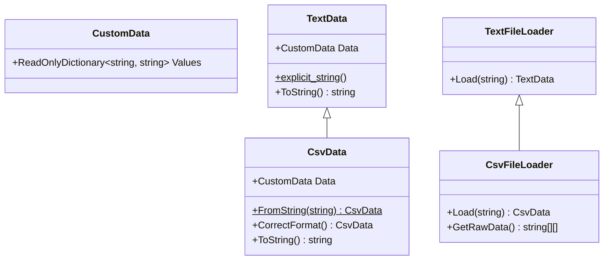

# 目次

これは連載「あすかの怪文書」の記事です。[目次はこちらからご覧になれます](https://zenn.dev/kmy/articles/asuka-cs-0-index)

# 言い訳

[頭が残念な人によるDDDの説明](https://zenn.dev/kmy/articles/asuka-cs-1-1-ddd)でも少し触れましたが、継承もポリモーフィズムも隠蔽の一種だというのが私の持論（）です。その隠蔽という目的を果たすために、ポリモーフィズムの実装（継承、実装）にあたって最低限必要なことと、起きがちな問題についてここで説明します。あなたはおそらく「こんなことあるわけない」と考えるでしょう。しかし、大規模アプリを開発していると設計は歪みがちで、このような問題も起こりえます。
本記事の内容には、SOLID原則のLSP（リスコフの置換原則）が深く関係しています。

# 問題

平文のテキストファイルからデータを作成するクラス、CSVファイルからデータを作成するクラスを作成しました。なお、`CsvData`は`TextData`のサブクラスで、どちらもイミュータブルな値オブジェクトとします。
このコードの問題点は何でしょうか？

```cs
class TextFileLoader
{
  public virtual TextData Load(string fileName)
  {
    return (TextData)File.ReadAllText(fileName);
  }
}

class CsvFileLoader : TextFileLoader
{
  public override CsvData Load(string fileName)
  {
    var textData = base.Load(fileName);
    var csvData = CsvData.FromString(textData.ToString());

    // 現在のデータをバックアップ
    File.WriteAllText($"{fileName}.bak", textData.ToString());

    // csvフォーマットにミスがあった場合は修正してファイルを上書きする
    File.WriteAllText(fileName, csvData.CorrectFormat().ToString());

    return csvData;
  }

  public string[][] GetRawData()
  {
    // ...
  }
}
```



## どこが問題？

クラスの継承によるオーバーライド、あるいはインターフェースの実装は、具象を隠蔽して抽象からアクセスできるようにします。つまり、このクラスの呼び出し側は、以下のようなコードを書けるよう正常に設計されていることを期待します。

```cs
class Animal
{
  public void LoadData(TextFileLoader loader)
  {
    TextData data = loader.Load(Settings.FileName);

    data.Values.TryGetValue("name", out string name);
    name ??= string.Empty;

    // ...
  }
}
```

呼び出し側は抽象に依存したコードを、具象意識なく呼び出せることを想定しています。それでは、この抽象のメソッドは正常に呼び出せる状態でしょうか。

基底クラス`TextFileLoader`の`Load`メソッドは正常に作動します。指定された名前のファイルを読み込み、その内容を返します。
しかしそれをオーバーライドした`CsvFileLoader`の`Load`メソッドは、異なった作動をします。基底クラスのそれと共通の動作は確かにしますが、それに加えてCSVフォーマットの誤りを修正し、ファイルを上書きします。
この挙動は、設計において２つの問題をもたらします。

* メソッドが副作用を起こしている
* 一部の具象による副作用のために、**抽象全体を一律に信頼できない**

副作用の詳しい説明は今後に預けるとして、ひと目で分かるのは、`CsvFileLoader`の`Load`メソッドが`Load`という名前を超える処理を行っている点です。これはメソッドの役割を超えており、ファイル処理をおこなううえで弊害をもたらします。ただでさえメソッドの設計が間違っているのに、さらに悪質なのが、このメソッドはオーバーライドによって隠蔽されているという点です。
例えば、CSVファイルを読み込むにあたって**書き込み処理を行いたくない事情がある**とき、あなたはどのように`LoadData`メソッドを実装するでしょうか。

```cs
class Animal
{
  public void LoadData(TextFileLoader loader)
  {
    TextData data;
    if (loader is CsvFileLoader)
    {
      TextFileLoader textLoader = new();
      TextData textData = textLoader.Load(Settings.FileName);

      data = CsvData.FromString(textData.ToString());
    }
    else
    {
      data = loader.Load(Settings.FileName);
    }

    data.Values.TryGetValue("name", out string name);
    name ??= string.Empty;

    // ...
  }
}
```

`Load`メソッドの呼び出しの際にダウンキャストを行い、型の判定をしています。これは、`Load`の実装の一部が想定と異なる挙動をするため、`Load`という抽象そのものが周囲からの信頼を失ったことを意味します。これは結果として抽象ではなく具象に依存する必要性に迫られます。オーバーロードによる具象の隠蔽を無意味化し、ポリモーフィズムの利点を奪います。

:::message
ダウンキャストを前提にした継承設計を行う場合もありますが、それは具象において抽象にはないメンバーを提供する場合です。今回のように、抽象からもアクセス可能な仮想メソッドでこのような行為に及ぶのは、そもそも設計が間違っています
:::

拡張性にも深く関わります。抽象化された`Load`メソッドを呼び出す`LoadData`メソッドは、`TextFileLoader`を継承したすべてのクラスの仕様を把握する必要が発生します。`TextFileLoader`を継承したクラスが新たに出てきた場合、`LoadData`メソッドをはじめ、このクラスに依存するメソッドを点検しなければいけません。

といっても根性があればある程度は可能になってしまうので、絶対に対応が不可能な例を１つ示します。`TextFileLoader`クラスと`LoadData`メソッドをまとめてDLLにして、外部から呼び出す場合です。この場合、呼び出し側アセンブリ上で作成した`TextFileLoader`クラスを継承したクラスは、`LoadData`メソッドから具象を直接参照することは出来ません。

## アプローチ

これはメソッドの副作用が根本的な原因ですので、それを直すことでプログラムは正常化します。

```cs
class TextFileLoader
{
  public virtual TextData Load(string fileName)
  {
    return (TextData)File.ReadAllText(fileName);
  }
}

class CsvFileLoader : TextFileLoader
{
  public override CsvData Load(string fileName)
  {
    TextData textData = base.Load(fileName);
    CsvData csvData = CsvData.FromString(textData.ToString());

    return csvData;
  }

  public string[][] GetRawData()
  {
    // ...
  }
}
```

ファイル書き込み処理がなくなったことで、呼び出し側は具象を意識せず`TextFileLoader`型の`Load`メソッドを呼び出すことが可能になります。ダウンキャストの必要がなくなり、コードがシンプルになるだけでなく、具象の差し替えが容易になります。
オーバーライドする場合は、元のメソッドと出力を揃えるべきです。またインターフェースを実装する場合は、意図された出力のみを行うべきです。

なお、ファイルフォーマットを修正する処理が必要ならば、別途メソッドを作成することをおすすめします。可能なら`TextFileLoader`型に`virtual`のメソッドを新設します。`TextFileLoader`のメソッドを増やしたくなければ、ダウンキャストを前提とした設計になりますが、インターフェースを作る手もあります。ただ、あまりダウンキャストを前提にした設計が増えすぎると、そのクラスを使うプログラマに具象に対する知識を要求します。呼び出し側が`new`を使うなどして具象に依存する場合はともかく、`static`ファクトリメソッドの使用などによって抽象のみに依存している場合、後者の手法は向いていないかもしれません。あまりにも抽象には不要で具象では必要な操作が多いのでしたら、具象のラッパを作成するか、または最初から具象に依存することを前提とした設計も検討してみてください。`switch`の型スイッチもまた、有効な手段の１つです。

:::message
共通の抽象メソッドがあるにかかわらずわざわざダウンキャストしてから呼ぶ行為は先述のようにコードの可読性、保守性を下げます。ただし、パフォーマンスの向上を目的におこなうことはあります。
最もメジャーな例の１つとして、LINQの`Count`メソッドが挙げられます。[.NET Coreでの`Count`メソッドの実装](https://source.dot.net/#System.Linq/System/Linq/Count.cs,577032c8811e20d3)は初心者でも読めるくらい平易なソースコードですが、そこからも分かる通り、`IEnumerable`の要素数をカウントする処理は本来、`IEnumerable`インターフェースが提供する`MoveNext`メソッドだけで十分です。しかし、事前に`ICollection`が実装されているか確認（これには`List`、`Array`を含む）して、実装されていればそのプロパティを返します。`List`や`Array`の中身をあらためて数えることなく、それぞれが保持している要素数カウンタ変数の値をそのまま返すことで、パフォーマンスの向上を実現しています。<br>
それとこれの違いは、「正常な値を返すためにやらなければいけないことであるか」の違いです。LINQの`Count`メソッドは、もし新しい種類の`IEnumerable`クラスが出現しても、そのクラスに対して不用意に`Count`することでパフォーマンスが落ちることはあれ、不正な値が返されることはありません。なので最悪メンテナンスしなくてもプログラム全体は正常に動くわけです。それに対して今回の記事で取り上げた`Load`メソッドは、ダウンキャストしないとプログラム全体が不正な挙動を示す場合があります。この場合、新しい具象型を作成する際にそれぞれのメソッドをメンテナンスする**義務**が発生してしまうのです。これは以前の記事でも問題に上げた、コンパイラによる制約を受けない「ルール」でもあります
:::

# まとめ

オーバーライドまたは実装とは、元のメソッドを拡張することではなく、具象を抽象に隠蔽することです。メソッドの実装を隠蔽するために、具象は抽象と全く同じ入力・出力を持つようつとめるべきです。それが不可能なら、新しいメソッドを作成するか、設計を見直してください。

実際、これは私がよく経験するケースです。

:::message
といっても、私が仕事上知り合った人の中で、ドメインモデルが書ける人は２人しか知りません。うち１人は他社の方、うち１人からはプログラミングの基本のうちごく一部しか教わらず設計論は当然一切教わっていないので、私の経験といえば、趣味での個人開発がほとんどです
:::

プログラムを拡張しようとすると、抽象（基底クラスや`interface`）では表現不可能な操作や状態が必ず現れます。その時の対応を見誤ると、今回挙げた例のように、具象を隠蔽することが困難になります。この他にも同様の状況になる理由は多くありますが、今回は（私にとって）代表的なもののみを紹介しました。
何度も繰り返しますが、継承や実装によってメソッドをオーバーライドまたは実装する行為とは具象の隠蔽であり、ブラックボックス化です。抽象の信頼性を向上するためにも、**継承、あるいは実装によって隠蔽された具象クラスのメソッドは、基底クラスのそれと差し替え可能でなければいけません**。これを遵守することは、別のサブクラスとの置換が可能であることを意味します。なぜならサブクラスAもBも同じ基底クラスと置換可能であり、三段論法が成立するからです。

この性質は、後の記事で説明する「依存の注入」でも非常に重要です。オブジェクト指向とは、隠蔽です。正常な隠蔽を行うためには、正常な具象の設計が不可欠です。その設計のための必要最低限の条件が、今回説明したLSP（リスコフの置換原則）であるとお考えください。

# 目次

これは連載「あすかの怪文書」の記事です。[目次はこちらからご覧になれます](https://zenn.dev/kmy/articles/asuka-cs-0-index)