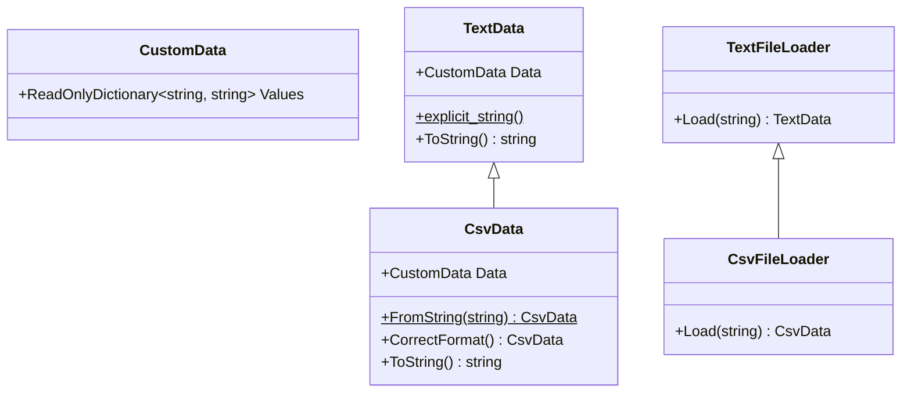

# 目次

これは連載「あすかの怪文書」の記事です。[目次はこちらからご覧になれます](https://zenn.dev/kmy/articles/asuka-cs-0-index)

# 言い訳

詳しくは後続の記事で述べますが、私はクラスの継承はすなわち具象の隠蔽であると考えています。[頭が残念な人によるDDDの説明](https://zenn.dev/kmy/articles/asuka-cs-1-1-ddd)でも少し触れましたが、継承もポリモーフィズムも隠蔽の一種だというのが私の持論（）です。
その隠蔽という目的を果たすために、継承にあたって最低限必要なことについてここで説明します。あなたはおそらく「こんなことあるわけない」と考えるでしょう。しかし、大規模アプリを開発していると設計は歪みがちで、この問題も起こりえます。
本記事の内容には、SOLID原則のLSP（リスコフの置換原則）が深く関係しています。

# 問題

平文のテキストファイルからデータを作成するクラス、CSVファイルからデータを作成するクラスを作成しました。なお、`CsvData`は`TextData`のサブクラスで、どちらもイミュータブルな値オブジェクトとします。
このコードの問題点は何でしょうか？

```cs
class TextFileLoader
{
  public virtual TextData Load(string fileName)
  {
    return (TextData)File.ReadAllText(fileName);
  }
}

class CsvFileLoader : TextFileLoader
{
  public override CsvData Load(string fileName)
  {
    var textData = base.Load(fileName);
    var csvData = CsvData.FromString(textData.ToString());

    // 現在のデータをバックアップ
    File.WriteAllText($"{fileName}.bak", textData.ToString());

    // csvフォーマットにミスがあった場合は修正してファイルを上書きする
    File.WriteAllText(fileName, csvData.CorrectFormat().ToString());

    return csvData;
  }
}
```



## どこが問題？

冒頭で述べたとおり、クラスの継承は具象を隠蔽するものです。つまり、このクラスの呼び出し側は、以下のようなコードを書けるよう正常に設計されていることを期待します。

```cs
class Animal
{
  public void LoadData(TextFileLoader loader)
  {
    TextData data = loader.Load(Settings.FileName);

    data.Values.TryGetValue("name", out string name);
    name ??= string.Empty;

    // ...
  }
}
```

それでは、このクラスが正常に呼び出せる状態でしょうか。

基底クラス`TextFileLoader`の`Load`メソッドは正常に作動します。指定された名前のファイルを読み込み、その内容を返します。
しかしそれをオーバーライドした`CsvFileLoader`の`Load`メソッドは、異なった作動をします。基底クラスのそれと共通の動作は確かにしますが、それに加えてCSVフォーマットの誤りを修正し、ファイルを上書きします。
この挙動は、設計において２つの問題をもたらします。

* メソッドが副作用を起こしている
* 副作用のために、クラスを抽象化することが困難である

副作用の詳しい説明は今後に預けるとして、ひと目で分かるのは、`Load`メソッドが`Load`という名前を超える処理を行っている点です。これはメソッドの役割を超えており、ファイル処理をおこなううえで弊害をもたらします。ただでさえメソッドの設計が間違っているのに、さらに悪質なのが、これが抽象によって隠蔽されているという点です。
例えば、CSVファイルを読み込むにあたって**書き込み処理を行いたくない事情がある**とき、あなたはどのように`LoadData`メソッドを実装するでしょうか。

```cs
class Animal
{
  public void LoadData(TextFileLoader loader)
  {
    TextData data;
    if (loader is CsvFileLoader)
    {
      TextFileLoader textLoader = new();
      TextData textData = textLoader.Load(Settings.FileName);

      data = CsvData.FromString(textData.ToString());
    }
    else
    {
      data = loader.Load(Settings.FileName);
    }

    data.Values.TryGetValue("name", out string name);
    name ??= string.Empty;

    // ...
  }
}
```

ダウンキャストが必須になり、せっかく隠蔽されていた`CsvFileLoader`クラスが表に出てしまっています。ダウンキャストはプログラマに、実装に関する知識を要求し、最低限の知識でプログラムを書くことを困難にします。これは継承により抽象化やクラスのカプセル化に成功したとは言いません。

保守性にも深く関わります。`LoadData`メソッドは、`TextFileLoader`を継承したすべてのクラスの仕様を把握する必要が発生します。`TextFileLoader`を継承したクラスが新たに出てきた場合、`LoadData`メソッドをはじめ、このクラスに依存するメソッドを点検しなければいけません。
といっても根性があればある程度は可能になってしまうので、絶対に対応が不可能な例を１つ示します。`TextFileLoader`クラスと`LoadData`メソッドをまとめてDLLにして、外部から呼び出す場合です。この場合、`TextFileLoader`クラスを継承したクラスは、それが呼び出し側アセンブリに存在するのであれば、`LoadData`メソッドから参照することは出来ません。

## アプローチ

これはメソッドの副作用が根本的な原因ですので、それを直すことでプログラムは正常化します。

```cs
class TextFileLoader
{
  public virtual TextData Load(string fileName)
  {
    return (TextData)File.ReadAllText(fileName);
  }
}

class CsvFileLoader : TextFileLoader
{
  public override CsvData Load(string fileName)
  {
    var textData = base.Load(fileName);
    var csvData = CsvData.FromString(textData.ToString());

    return csvData;
  }
}
```

ファイル書き込み処理がなくなったことで、呼び出し側は具象を意識せず`TextFileLoader`型の`Load`メソッドを呼び出すことが可能になります。ダウンキャストの必要がなくなります。
なお、ファイルフォーマットを修正する処理が必要ならば、別途メソッドを作成することをおすすめします。可能なら`TextFileLoader`型に`virtual`のメソッドを新設します。`TextFileLoader`のメソッドを増やしたくなければ、ダウンキャストが必要にはなりますが、インターフェースを作る手もあります。

# まとめ

継承の本当の目的は、基底クラスの処理を拡張することではありません。それは目的へ至るまでの過程にすぎません。継承において本当に重要なのは、その拡張された処理を隠蔽することです。しかしダウンキャストは、通常の場合、その隠蔽の主目的を破壊します。クラスの実装を隠蔽するために、具象は抽象と全く同じ入力・出力を持つようつとめるべきです。それが不可能なら、新しいメソッドを作成するか、設計を見直してください。

実際、これは私がよく経験するケースです。といっても、私が仕事上知り合ったドメインモデルが書ける人は２人しかいません。うち１人は他社の方、うち１人からはプログラミングの基本のうちごく一部しか教わらず設計論は当然一切教わっていないので、私の経験といえば、趣味での個人開発になります。プログラムを拡張しようとすると、抽象（基底クラスや`interface`）のインターフェースでは実装不可能な処理が必ず現れます。その時の対応を見誤ると、今回挙げた例のように、具象を隠蔽することが困難になります。この他にも同様の状況になる理由は多くありますが、今回は（私にとって）代表的なもののみを紹介しました。
このケースは、継承の本質を基底クラスの拡張であると見誤っている時によく発生します。プログラミング入門書ではよく「拡張」というフレーズが出てきます。継承の説明としては正しいですが、オブジェクト指向プログラミングの設計論を語る上では不十分で誤解を招く表現であると私は考えます。何度も繰り返しますが継承とは実装の隠蔽であり、**継承によって隠蔽された具象クラスは、基底クラスと差し替え可能でなければいけません**。
この項目は、後の記事で説明する「依存の注入」でも非常に重要です。オブジェクト指向とは、隠蔽です。正常な隠蔽を行うためには、正常な具象の設計が不可欠です。その設計のための必要最低限の条件が、今回説明したLSP（リスコフの置換原則）であるとお考えください。
