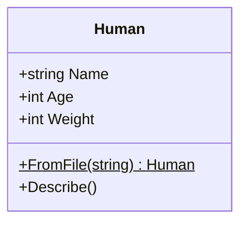
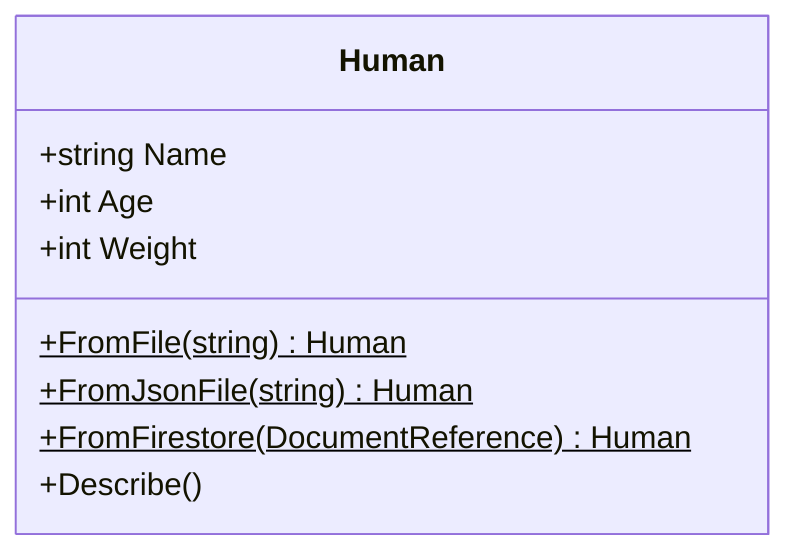
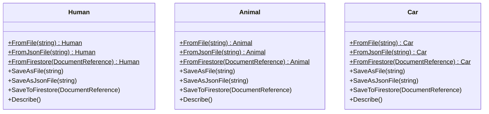
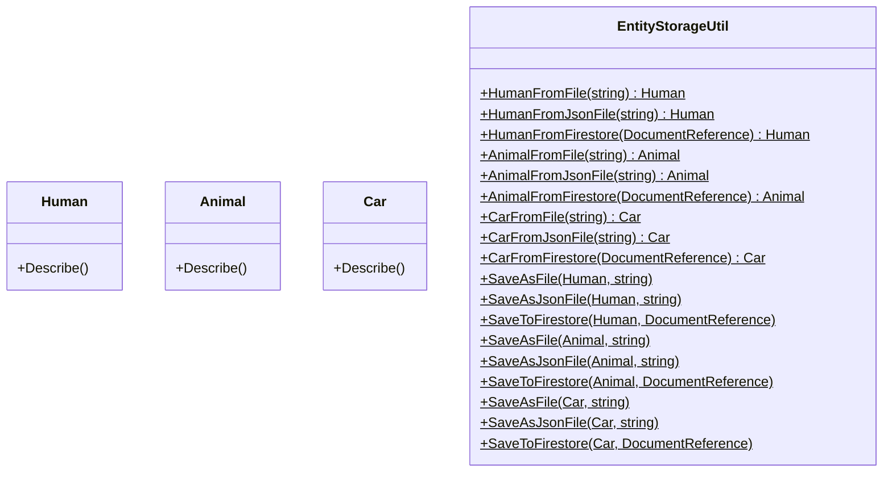
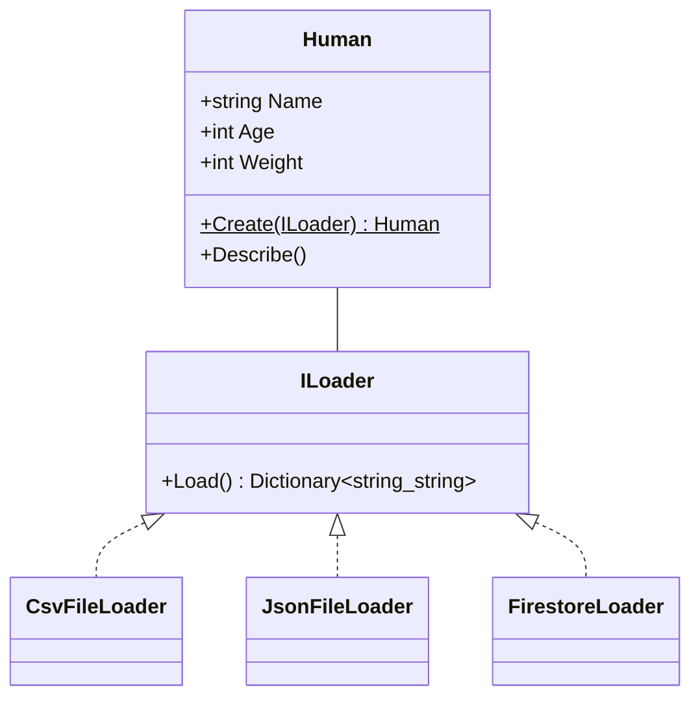
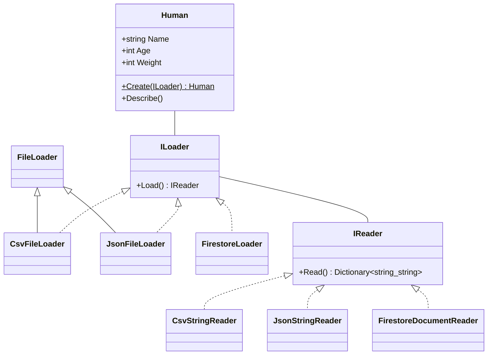

# 目次

これは連載「あすかの怪文書」の記事です。[目次はこちらからご覧になれます](https://zenn.dev/kmy/articles/asuka-cs-0-index)

# 言い訳（要出典）

**依存性の注入**（要出典）という考え方は、オブジェクト指向の集大成であり（要出典）、すべてのオブジェクト指向言語プログラマが必ずマスターすべきです（要出典）。依存性の注入をマスターしていない人はC#やJavaのプログラマを名乗るべきではありません（要出典）。
私はこの言葉をはじめて聞いた時、すぐには理解できず（要出典）、これを理解している人はすごい（要出典）、理解することで自分の技術力の大きなレベルアップに繋がるかもしれない（要出典）、という感想を持ちました（要出典）。今考えてみれば、それは全くの誤りです（要出典）。依存性の注入は、オブジェクト指向を理解するならかなり初期の方でマスターすべき基本的技術であり（要出典）、これを理解して初めてオブジェクト指向プログラミングの土俵に立ったと言えます（要出典）。

:::message
でも、オブジェクト指向をドメインモデルだと考えている人自体、実は少ないんですよね（要出典）
:::

ただし、依存性の注入はオブジェクト指向の学習で最初にやるべきではありません（要出典）。これまでに説明した原則などを理解して初めて、使いこなすことが出来ます（要出典）。
この記事では、SOLID原則のDIPというよりは、むしろ依存性の注入の重要性について述べます（要出典）。なおこの記事には間違いしか書かれていませんので、他の人の書いた記事や書籍だけを読んでください。

:::message
インターネットの記事を読んでいると、「依存性の注入」という和訳は誤りであるという意見を見かけます（要出典）。ただ、その言葉が広く使われていることも事実です（要出典）。本記事では「依存性の注入」という言葉を使います（要出典）
:::

# 問題

これは、人間の年齢・体重を管理するクラスです。そのデータは、CSVファイルへの保存によって永続化されています。
将来的にこのアプリケーションは、CSVファイルのほか、JSONファイル、クラウド（Firebaseなど）からのデータ読み込みへの対応を予定しています。
複数の読み込み方法を想定した設計へのリファクタリングを行いたいのですが、どのように修正しますか？

```cs
class Human
{
  public string Name { get; set; } = string.Empty;

  public int Age { get; set; }

  public int Weight { get; set; }

  public static Human FromFile(string fileName)
  {
    string raw = File.ReadAllLines(fileName)[0];
    string[] data = raw.Split(",");
    return new
    {
      Name = data[0],
      Age = int.Parse(data[1]),
      Weight = int.Parse(data[2]),
    };
  }

  public void Describe()
  {
    Console.WriteLine($"{this.Name} -- age {this.Age}, weight {this.Weight}");
  }
}
```



## アプローチA

まず、多くの人が回答するであろう最もシンプルな回答例を示します。単純に、読み込み方法の数だけメソッドを追加します。

```cs
class Human
{
  public string Name { get; set; } = string.Empty;

  public int Age { get; set; }

  public int Weight { get; set; }

  public static Human FromFile(string fileName)
  {
    // ...
  }

  public static Human FromJsonFile(string fileName)
  {
    // ...
  }

  public static Human FromFirestore(DocumentReference ref)
  {
    // ...
  }

  public void Describe()
  {
    Console.WriteLine($"{this.Name} -- age {this.Age}, weight {this.Weight}");
  }
}
```



これは最も単純な解決法です。実際、規模の小さいアプリケーションであれば、この対処で十分でしょう。
しかし大規模アプリケーションを設計する際は問題になります。

そもそも問題の時点で、ファイルの読み込み・解析処理は`Human`クラスの責務に見合うでしょうか？`Human`クラスはあくまで人間に関する状態・操作を提供すべきであり、データの読み取りは別の責務として扱うべきです。
責務が複数含まれているため、以下のような問題が発生します。

例えば、データを修正して保存する場合を考えましょう。その処理は上記のソースコードには含まれませんが、アプリを開発する上で含まれる可能性の非常に高い処理です。上記の例に従って考えると、保存処理は以下のように設計されます。

```cs
class Human
{
  public string Name { get; set; } = string.Empty;

  public int Age { get; set; }

  public int Weight { get; set; }

  public static Human FromFile(string fileName)
  {
    // ...
  }

  public static Human FromJsonFile(string fileName)
  {
    // ...
  }

  public static Human FromFirestore(DocumentReference ref)
  {
    // ...
  }

  public void SaveAsFile(string fileName)
  {
    // ...
  }

  public void SaveAsJsonFile(string fileName)
  {
    // ...
  }

  public void SaveToFirestore(DocumentReference ref)
  {
    // ...
  }

  public void Describe()
  {
    Console.WriteLine($"{this.Name} -- age {this.Age}, weight {this.Weight}");
  }
}
```

保存方法の数だけメソッドが増え、クラスを冗長にさせます。また、永続化の方法が増えるたび、メソッドを付け足ししなければいけません。

もう１つ問題があります。問題のプログラムでは`Human`クラスのみを掲示しましたが、実際にアプリケーションが扱うデータは`Human`だけとは限りません。`Animal`など別のデータも取り扱う時、同じメソッドを各クラスにいちいち追加するのでしょうか？永続化の方法が増えると、それらのクラスに追加のメソッドを付け加えなければいけません。このことは、プログラムの保守性を不安定なものにします。
複数のクラスに同じ`static`メソッドが発生するのは仕方ないことかもしれませんが、せめてコンパイラによるチェックを受けず手動で管理せざるを得ない共通部分は必要最小限にしたいものです。



さらにもう１つ問題があります。このクラスを呼び出す側はどのようなコードを書くことになるか、想像できるでしょうか？
以下のようなコードになります。

```cs
if (this.storageType == Storage.File)
{
  human = Human.FromFile(this.fileName);
}
else if (this.storageType == Storage.JsonFile)
{
  human = Human.FromJsonFile(this.jsonFileName);
}
else if (this.storageType == Storage.Firestore)
{
  human = Human.FromFirestore(this.firestoreRef);
}
```

保存形式を格納する変数を別途用意し、それに対応したメソッドを`if`分岐で呼び出さなければいけません。メソッドへ渡す引数も別々に管理しなければいけないというのも気になります。さらに今後新しい永続化方法を追加する時、この条件分岐もメンテナンスの対象になるというのは言うまでもありません。機能追加を行う時、影響範囲が増えることはプログラムの拡張性を損ない、大規模アプリケーションの保守を困難にします。

## アプローチB

アプローチAにおいて、`Human`クラスは責務分割ができていないと述べました。したがって、ファイル読み込み処理を`static`クラスに移動しました。



根本的な解決になっていないことは明らかです。そればかりでなく、クラスを増やすたび`EntityStorageUtil`クラスをメンテナンスしなければいけないので、影響範囲を無駄に増やすことになります。

## アプローチC

少々の偏見は入りますが、オブジェクト指向初心者がやりそうな解を示します。まず、責務分割により読み込み処理をクラスへ変換しようと考えるでしょう。アプローチBでは静的クラスへの変換だったため失敗しましたが、今回はその反省を生かして通常のクラスを作成し、接続に必要な情報を状態としてクラスに持たせます。

```cs
class CsvFileLoader
{
  public CsvFileLoader(string fileName)
  {
    // ...
  }

  public List<string> Load()
  {
    // ...
  }
}

class JsonFileLoader
{
  public JsonFileLoader(string fileName)
  {
    // ...
  }

  public Dictionary<string, string> Load()
  {
    // ...
  }
}

class FirestoreLoader
{
  public FirestoreLoader(string fileName)
  {
    // ...
  }

  public Dictionary<string, object> Load()
  {
    // ...
  }
}
```

確かに接続やデータ取得に必要な情報をインスタンスに格納することで、データ読込時に接続情報を直接取り扱う必要がなくなり、処理をシンプルにまとめることが可能です。
結果論ではありますが、これは非常に惜しいです。なぜならば、`Human`クラス、呼び出し側での条件分岐を除去できないからです。それぞれ、以下のコードに変わるでしょう。

```cs
class Human
{
  public string Name { get; set; } = string.Empty;

  public int Age { get; set; }

  public int Weight { get; set; }

  public static Human Create(CsvFileLoader loader)
  {
    List<string> data = loader.Load();
    return new
    {
      Name = data[0],
      Age = int.Parse(data[1]),
      Weight = int.Parse(data[2]),
    };
  }

  public static Human Create(JsonFileLoader loader)
  {
    Dictionary<string, string> data = loader.Load();
    return new
    {
      Name = data["Name"],
      Age = int.Parse(data["Age"]),
      Weight = int.Parse(data["Weight"]),
    };
  }

  public static Human Create(FirestoreLoader loader)
  {
    Dictionary<string, object> data = loader.Load();
    return new
    {
      Name = data["Name"].ToString(),
      Age = (int)data["Age"],
      Weight = (int)data["Weight"],
    };
  }

  public void Describe()
  {
    Console.WriteLine($"{this.Name} -- age {this.Age}, weight {this.Weight}");
  }
}
```

```cs
if (this.storageType == Storage.File)
{
  human = Human.Create(this.csvFile);
}
else if (this.storageType == Storage.JsonFile)
{
  human = Human.Create(this.jsonFile);
}
else if (this.storageType == Storage.Firestore)
{
  human = Human.Create(this.firestore);
}
```

永続化手段が増えるたびに`if`分岐、`static`メソッドのメンテナンスをしなければいけないという問題点は変化しません。
さらに言うとこれは、単一責任原則の目的である「クラスを変更する理由は唯一にする」にも抵触し、クラスの保守性は改善していません。これは、さらにリファクタリング可能です。

## アプローチD

オブジェクト指向に基づいた一般的な解を示します。アプローチCで作成した４つのクラスに、同一のインターフェースを実装させます。

```cs
interface ILoader
{
  Dictionary<string, string> Load();
}

class CsvFileLoader : ILoader
{
  public CsvFileLoader(string fileName, IList<string> columnNames)
  {
    // ...
  }

  public Dictionary<string, string> Load()
  {
    // ...
  }
}

class JsonFileLoader : ILoader
{
  public JsonFileLoader(string fileName)
  {
    // ...
  }

  public Dictionary<string, string> Load()
  {
    // ...
  }
}

class FirestoreLoader : ILoader
{
  public FirestoreLoader(string fileName)
  {
    // ...
  }

  public Dictionary<string, string> Load()
  {
    // ...
  }
}
```

これを見ると、`CsvFileLoader`のコンストラクタに`columnNames`が追加されていることに気づきます。同じインターフェースを実装させるためには`Load`メソッドの出力も揃えなければいけません。`columnNames`は、CSVの各列に名前をつけます。`List<string>`の各行にラベルを付け、`Dictionary<string, string>`へ変換するのに役立ちます。
インターフェースを実装するためにコンストラクタのシグニチャを変更するのは、よくある手法です。なぜなら、最初のインスタンス生成時にどうしても`new`句によるクラス名への依存が発生し、条件分岐が必須になるからです。その`new`による依存発生時に独自のパラメータを追加することは、実装への依存を増やすことにはつながらないため、問題ありません。

:::message
クラス名を動的に指定して`Activator`を使うこともできますが、そこまでやる人はまずこの連載を読む必要がありません。自分でDIコンテナ構築するなり頑張ってください
:::

```cs
// private ILoader? loader;

if (this.storageType == Storage.File)
{
  this.loader = new CsvFileLoader(this.fileName, Columns.Human);
}
else if (this.storageType == Storage.JsonFile)
{
  this.loader = new JsonFileLoader(this.fileName);
}
else if (this.storageType == Storage.Firestore)
{
  DocumentReference refObj;

  // ...

  this.loader = new FirestoreLoader(refObj);
}
```

しかし、一度`new`してしまったあとの`loader`の扱い方は、驚くほど簡単です。まず、`Human`クラスの読み込み処理は以下のように簡略化できます。

```cs
class Human
{
  public string Name { get; set; } = string.Empty;

  public int Age { get; set; }

  public int Weight { get; set; }

  public static Human Create(ILoader loader)
  {
    var data = loader.Load();
    return new
    {
      Name = data["Name"],
      Age = int.Parse(data["Age"]),
      Weight = int.Parse(data["Weight"]),
    };
  }

  public void Describe()
  {
    Console.WriteLine($"{this.Name} -- age {this.Age}, weight {this.Weight}");
  }
}
```



これまでのように、CSVかJsonかFirestoreかでメソッドを分ける必要はもはやありません。この`Create(ILoader)`メソッドがあれば十分です。
呼び出し側はただひとつ、以下のコードを書けばいいわけです。

```cs
var human = Human.Create(this.loader);
```

これまであったような条件分岐は必要ありません。一度`new`してしまえば、そのあとの処理を簡潔に記述することが出来ます。

メンテナンスも簡略化されます。新しい永続化方式を追加する時は、新しい具象クラスを追加する、インスタンスを作成する処理をいじるだけで終わりです。抽象のみに依存する`Create`を含む全ての処理を修正する必要はありません。このことは、修正時の影響範囲を最小限にすることにも繋がります。

## アプローチE

ここから先は本記事の趣旨とはやや外れますが、アプローチDの設計をさらにブラッシュアップしてみましょう。
まず、今回作成したクラスはまた責務分割が可能なことにお気づきでしょうか。すでにそれぞれのクラスの名前にヒントが出ています。

* CsvFileLoader
* JsonFileLoader
* FirestoreLoader

`CsvFileLoader`と`JsonFileLoader`は、ともに「ファイルからテキストを読み込む」という処理が共通しています。また`FirestoreLoader`も、今回はドキュメントと呼ばれるFirestore保存形式の１つをそのままデータに変換しましたが、ドキュメントの一部のみをJSONフォーマットの文字列として取得し、それを読み取る場合も考えられます。
これらのクラスは、以下の処理を行っています。

* ストレージから情報を取得する
* それをプログラムで読み取り可能な形式に変換する

そのため、少なくとも`CsvFileLoader`と`JsonFileLoader`では処理の重複が発生しています。上記２つの処理を別々のオブジェクトに分解してしまいます。

:::message
記事が冗長になるのでインターフェースだけを示します
:::

```cs
interface ILoader
{
  IReader Load();
}

interface IReader
{
  Dictionary<string, string> Read();
}
```



`CsvFileLoader`と`JsonFileLoader`に共通の基底クラス`FileLoader`を設定することで、ファイルから文字列を取得する処理が共通化されたことにお気づきでしょうか。
また、呼び出し側は以下の処理を記述します。

```cs
class Human
{
  // ...

  public static Human Create(ILoader loader)
  {
    var data = loader.Load().Read();    // ここが変わった
    return new
    {
      Name = data["Name"],
      Age = int.Parse(data["Age"]),
      Weight = int.Parse(data["Weight"]),
    };
  }

  // ...
}
```

もちろんこの他にも考えられる解放は複数存在します。
ただアプローチEにも欠点があります。責務を細かく分割することはクラスの保守性を向上させる反面、プログラムを複雑化させます。よって小規模なアプリケーションでわざわざこの書き方をすべきであるかと言うと、必ずしもそうは言えないと思います。小規模なプログラムでは手を抜くことも、かえって保守性を向上させる場合があります。
状況に応じて様々な設計が想定されるところが、オブジェクト指向の最も難しく、面白いところです。

## アプローチF

実はこれはもっとリファクタリング出来ます。簡易的なデータ読み込みフレームワークを自作してしまうのです。そして、`Human`クラスのプロパティに独自の`Attribute`を設定し、リフレクションを駆使してプロパティを設定して‥‥‥‥こにょこにょすれば、`Human`クラスに`Create`メソッドを作る必要すらなくなります。
いっそのこと、DIコンテナを自作するかライブラリから持ってきて使う手もあります。
ですがここまでやると完全に本記事の趣旨から外れますので、各自妄想してお楽しみください。既存のライブラリを使う手もあります。手段は無限にあります。

# まとめ

複数の具象クラスは共通点を持ちます。抽象クラスやインターフェースはその共通点を可視化し、アクセスする手段を提供します。その要件さえ満たしていれば、どのような具象クラスであっても抽象からアクセスできるようになります。これは拡張性、保守性の観点で、オブジェクト指向プログラミングに大きなインパクトを与えます。
プログラムが抽象のみに依存することによって、プログラムの修正範囲が最小限になります。また、新しい具象クラスを作成する時に、既存の具象クラスを修正する必要もありません。具象同士の競合に関しては別途議論する必要がありますが、抽象への依存がもたらすメリットはあまりにも大きいです。
大規模アプリケーションを設計する時に、この考え方は必要不可欠です。これなくして合理的設計はまず不可能でしょう。

むろん、[リスコフの置換原則（要出典）](https://zenn.dev/kmy/articles/asuka-cs-1-6-subclass-method)の遵守は不可欠です。具象の出力を均一化し、抽象に対する信頼性を向上させることが、抽象への依存の大前提です。オブジェクト指向初心者は、まずそこを意識した継承・実装を行うべきです。

今回紹介したのは、アプローチD〜Eでは手動での依存性注入です。これを自動化するのがDIコンテナですが、私はプログラミング初心者なので、既存の専用ライブラリを使うよりも`static`ファクトリメソッドや、抽象を返却するプロパティを作って使ったほうが楽かなと思いますし、実際そちらをよく使います。いずれにしろ、箱の中身を見ずに外観だけで操作できるような設計は、オブジェクト指向が提供する抽象化をうまく利用したものと言え、大変重要な概念です。
それにも関わらず、実際の現場では（おそらくベンチャー企業や外資系企業は例外でしょうが）使用例がほとんど見られないのがとても残念です。使用例がもしあったとしても、それはフレームワークを使うために義務的に使っているものばかりで、能動的な抽象への依存はありません。これは、日本のプログラマがC#やJavaなどオブジェクト指向言語を使うメリットを十分に享受していないことを意味します。日本のIT企業の残業が多いといわれるのは、非常識な顧客や案件の存在はもちろんのことですが、効率的かつ将来を見据えた、**変化に強い設計**をおこなうスキルが十分に広まっていないというのもあるかもしれません。

:::message
効率性を重視する人は、そもそもこんな素人による間違いだらけの連載を読んではいけません。[目次のページ](https://zenn.dev/kmy/articles/asuka-cs-0-index)で紹介する書籍を読んだほうが、遥かに時間を節約できます
:::

# 目次

これは連載「あすかの怪文書」の記事です。[目次はこちらからご覧になれます](https://zenn.dev/kmy/articles/asuka-cs-0-index)