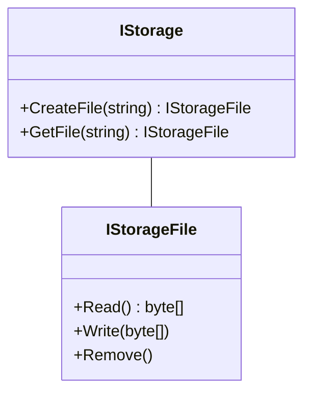
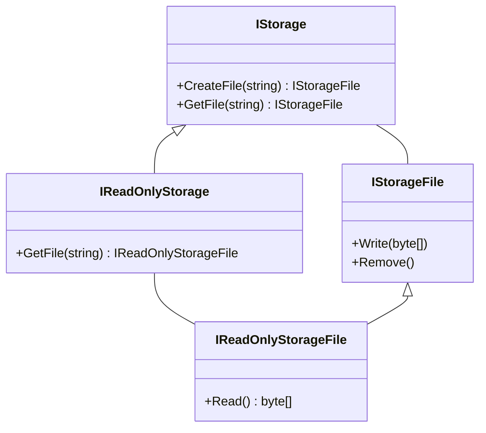

# 目次

これは連載「あすかの怪文書」の記事です。[目次はこちらからご覧になれます](https://zenn.dev/kmy/articles/asuka-cs-0-index)

# 言い訳

SOLID原則は、S（単一責任原則）、O（オープンクローズド原則）、L（リスコフの置換原則）、I（インターフェース分離原則）、D（依存性逆転原則）から成ります。多くのサイトではSOLIDの順番で紹介されることが多いですが、今回はDとIを入れ替えて、SOLDIの順番で記事を作りました。
その理由は単純です。ISP（インターフェース分離原則）は、トランザクションスクリプトから脱却し、ドメインモデルによる設計をある程度行うようになって、初めて遭遇する問題だからです。オブジェクト指向プログラミングを始める前に知るべき知識は、SOLDだけで十分です。ISPも本当は知るべきなのですが、オブジェクト指向の設計を実践した後でないと理解・共感は難しいかもしれません（あくまで私の個人的感想です）。
なので、オブジェクト指向に自信のない方はこの記事を読み飛ばしていただくのも一つの手かもしれませんが、予備知識として知ってほしいという気持ちもあります。そもそもこの連載よりももっと有益な記事が世の中にはたくさんあります。

今回は、私が設計するにあたって、たまにやらかす例を紹介します。これは、開発を進めながら機能を追加する時によく起きます。

# 問題

外付けストレージファイルを操作するインターフェースを作成します。これらのインターフェースは、以下への利用を想定して作成しました。

* ローカルコンピュータ上のファイル（自由に読み書き可能）
* CD-ROM上のファイル（読み取りのみ可能）
* 書き込み権限のない共有フォルダ上のファイル（読み取りのみ可能）

インターフェースをこのまま使うことに問題はないでしょうか？

```cs
interface IStorage
{
  IStorageFile CreateFile(string path);

  IStorageFile GetFile(string path);
}

interface IStorageFile
{
  byte[] Read();

  void Write(byte[] data);

  void Remove();
}
```



## どこが問題？

まず、言葉自体が少々古いかもしれませんが、CD-ROMは一昔前はよく使われていたアイテムです。現在も一部の高価なコンピュータには、CDを格納するデバイスがあるかもしれません。CD-ROMは、ファイルの読み取りのみ可能で、書き込み・削除はできません。
それぞれのストレージに与えられている権限は、以下のとおりです。

| | Create | Read | Write | Remove |
| --- | --- | --- | --- | --- |
| ローカル | ○ | ○ | ○ | ○ |
| CD-ROM | ✕ | ○ | ✕ | ✕ |
| 共有フォルダ | ✕ | ○ | ✕ | ✕ |

さて、これを実装する時、例えば読み取り限定の共有フォルダではどのようなコードになるでしょうか。普通に考えると、以下のコードになります。

```cs
class SharedFolderFile : IStorageFile
{
  private readonly string path;

  public SharedFolderFile(string path)
  {
    this.path = path;
  }

  public byte[] Read()
  {
    return File.ReadAllBytes(this.path);
  }

  public void Write(byte[] data)
  {
  }

  public void Remove()
  {
  }
}
```

しかし、この実装にもまた、問題があります。この実装の呼び出し側は、`Write`メソッド、`Remove`メソッドが**成功したか知る手段がありません**。これらのメソッドの呼び出しによって、抽象の呼び出し側はファイルの中身が思い通りの内容に書き換えられたことを前提に処理を進めてしまうので、後続の処理でバグが発生する可能性が高いです。よって、呼び出しに失敗したことを知らせるために以下のコードを書かなければいけません。

```cs
  public void Write(byte[] data)
  {
    throw new NotSupportedException();
  }

  public void Remove()
  {
    throw new NotSupportedException();
  }
```

:::message
似た状況で、例外を投げずメソッドの中身を本当に空っぽにすることもあります。しかしそれは、メソッドが別に呼び出されなくてもそのあとの処理に影響がない場合に限られます
:::

しかし、ひとつ考えてみましょう。例えばGUIアプリケーションでこの抽象を使う場合、画面にはファイルを「読み込む」「保存する」２つのボタンが出現します。ここでユーザーが「保存する」ボタンを押した後に、はじめてエラーが発生します。ユーザーはその時に、このファイルは保存できないことを知ります。ファイルの中身を編集したあとでこのエラーが起きると酷です。せめて保存ボタンを押す前、理想は編集する前に保存可能であるかどうか知りたいものです。
問題のインターフェースでは、保存が可能であるか知るために、いったん保存処理を走らせなければいけませんが、それは非効率です。

現状のインターフェースで呼び出し側がそれを把握する手段は、以下があります。

* ダウンキャストによって実装の型を知る
  * [むろん抽象化されたメソッドを呼び出す目的でのダウンキャストはナンセンスです](https://zenn.dev/kmy/articles/asuka-cs-1-6-subclass-method)。抽象が具象を信頼できない状態は、正しい抽象とはいえません
* 具象クラスを`new`するときにフラグを設定する
  * 実際に`new`するのが`static`ファクトリメソッド内である場合、抽象化されたインスタンスとフラグをあわせて扱わなければいけません。２つの変数を同時に扱う必要があり、プログラムを複雑化させます。このフラグは、抽象化されたインスタンスで参照できるようにする必要があります

これには２つのアプローチ手段があります。SOLID原則のISP的にはアプローチBが正解ですが、AとBどちらにも一長一短があり、状況に応じて使い分ける必要があります。

## アプローチA

書き込み可能であるかのフラグを、インターフェースのプロパティとして公開します。

```cs
interface IStorageFile
{
  bool CanWrite { get; }

  byte[] Read();

  void Write(byte[] data);

  void Remove();
}
```

これは最も実装が容易です。これを実装するクラスは、ただ以下のメンバーを追加するだけで済みます。

```cs
  public bool CanWrite => true;
```
```cs
  public bool CanWrite => false;
```

しかし、呼び出し側は書き込み処理を行う前に必ず以下のコードを実行しなければなりません。

```cs
if (file.CanWrite)
{
  file.Write(data);
}
```

メソッドの定型処理化は、呼び出し側に負担をかけ、またプログラムの保守性を下げます。

## アプローチB

`IStorageFile`の基底インターフェースとして、`IReadOnlyStorageFile`を作成します。

```cs
interface IReadOnlyStorage
{
  IReadOnlyStorageFile GetFile(string path);
}

interface IStorage : IReadOnlyStorage
{
  IStorageFile CreateFile(string path);

  new IStorageFile GetFile(string path);
}

interface IReadOnlyStorageFile
{
  byte[] Read();
}

interface IStorageFile : IReadOnlyStorageFile
{
  void Write(byte[] data);

  void Remove();
}
```



ストレージのインスタンスを提供する`static`ファクトリメソッドは`IReadOnlyStorage`を返しますが、呼び出し側はそれを任意で`IStorage`にダウンキャストします。これによって、呼び出し側はストレージが書き込み可能であるかを知ることができます。
この方法には、アプローチAと違ってもう１つメリットがあります。**呼び出し可能なメソッドのみにアクセスできる**という点です。これは、アプローチAにあったような`Write`や`Remove`呼び出し時にルールとして発生する`if`分岐を不要にします。

```cs
IReadOnlyStorage readOnlyStorage = Storages.Default;
if (readOnlyStorage is IStorage storage)
{
  var file = storage.GetFile("test.txt");
  file.Write(data);
}
```

一方でこれは、呼び出し側にダウンキャストに関する前提知識を要求します。`IReadOnlyStorage`が`IStorage`にダウンキャスト可能であるという事実は、IDEのインテリセンスでは提供されず、呼び出し側コードを書くプログラマは資料を見ないとこのコードを導けません。不安であれば、以下のメソッドをインターフェースに加えるのもよいでしょう。

```cs
interface IReadOnlyStorage
{
  IReadOnlyStorageFile GetFile(string path);

  IStorage? AsWritable()
    => this as IStorage;
}
```

`AsWritable`メソッドは、自身のストレージが書き込み可能であればそのインスタンスを、不可能であれば`null`を返します。これはインテリセンスからアクセス可能であり、プログラマは前提知識がなくてもこのコードを導くことが出来ます。

```cs
IReadOnlyStorage readOnlyStorage = Storages.Default;
if (readOnlyStorage.AsWritable() is { } storage)
{
  var file = storage.GetFile("test.txt");
  file.Write(data);
}
```

:::message
上の書き方はあまり直感的ではないので、こんな書き方できるといいな‥‥いいのに‥‥（※C# 9現在不可能です）
```cs
if (readOnlyStorage.AsWritable() is not null storage)
```
今できる中でもっと直感的な書き方ってあります？`TryGetWritable`メソッド作っちゃう？
:::

:::message
ただこの実装ですと、`IStorage`である`storage`インスタンスからも`AsWritable`メソッドへアクセスできるあたりが、あまりスマートではないですね。また、インターフェース内の`new`演算子もちょっと気持ち悪さがあります（少なくとも私は、この記事内の例示で生まれて初めて使いました）。いっそのこと`IReadOnlyStorage`と`IStorage`の継承関係を解消してしまうのもひとつの手かもしれません。
:::

また、これには欠点があります。例えば以下のような状況になった場合を考えます。

| | Create | Read | Write | Remove |
| --- | --- | --- | --- | --- |
| ローカル | ○ | ○ | ○ | ○ |
| CD-ROM | ✕ | ○ | ✕ | ✕ |
| 共有フォルダ | ○ | ○ | ○ | ✕ |

共有フォルダ上でファイル作成、書き込みができるようになりました。ただし削除はできません。このようなとき、共有フォルダ専用のインターフェースを新たに作成する必要が発生します。その場合、以下のインターフェースを作ることになります。

* Create、Read、Write、Remove可能
* Read可能
* Create、Read、Write可能

しかし、このあと他の種類・権限を持ったストレージが続々出てくると、この方式は破綻します。４つの権限の組み合わせの数は16通り（全ての権限がない場合も含む）です。同じようなインターフェースを16個も作ってしまうのは現実的ではありません。
代案として、`ICreatableStorage`、`IReadableStorage`などのように、権限単位でインターフェースを細かく分ける手もあります。これも抽象の呼び出し側にダウンキャストの知識を要求するだけでなく、権限の種類が増えた時は使えなくなります。

実装によって権限が細かく制御されてしまう場合、アプローチBはこれに向いていません。呼び出し側にとってはアプローチBのほうがシンプルですが、やはり状況によってはアプローチAがより現実的な選択肢になるでしょう。

# まとめ

長いインターフェースを分離することは、空メソッドを全て削減したり不要な`async`メソッドを削除したりすることは完璧にできないこともあるものの、インターフェースの実装の一部を簡略化し、プログラマの負担を軽減します。

意外かもしれませんが、C#の配列は`IList`を実装します。この`IList`は、配列のインデクサ（`arr[5]`という書き方）が実装されていることを示すために実装されたものと考えていますが、同時に`Add`メソッド、`Remove`メソッドなど、本来固定長の配列が持つべきでないメソッドも提供します。配列の`Add`メソッドは`NotSupportedException`を返すため、`IList.Add`メソッドは厳密に安全であるとは言えません。この状況に対応するために`IList`には`IsFixedSize`、`IsReadOnly`プロパティが用意されています。
これがスマートな実装であるかどうかは、本記事でもアプローチBの想定されるデメリットとして挙げましたが、やはり様々な意見があると思います。ですが、大規模アプリケーション設計にあたって、抽象の提供する一部の操作が可能か不可能かが実装によって変わることがあるのは事実です。その場合は、リスコフの置換原則に違反しない範囲で、インターフェースにおいて正常な実装が可能になるよう、設計を見直す必要があります。