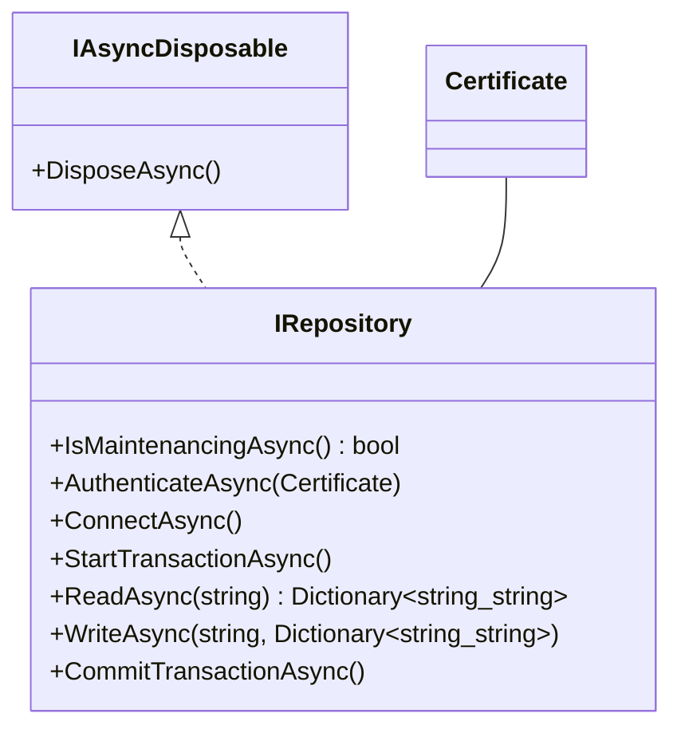
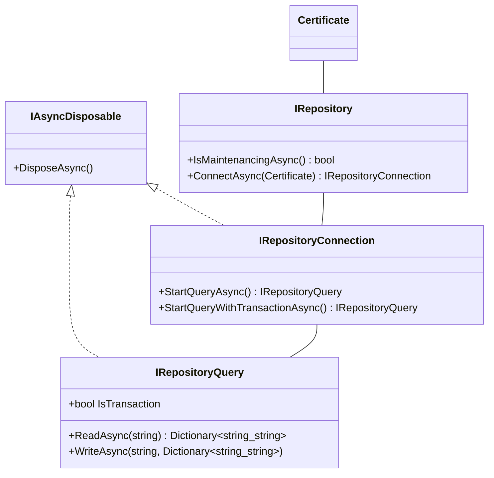

# 言い訳

ここでは、ある記事で没にしたものの別の記事で使うかもしれないコードを置いときます。

# 問題

プログラム上のメモリ、ローカルコンピュータ上のファイル、データベース（MySQL）、クラウドの４種類のストレージのデータを読み書きするクラスを作成します。それらのクラスには、共通して以下のインターフェースを実装しようと考えています。なおプログラム上のメモリとは、単にC#の文法上の変数をさします。
これをこのまま使用しても問題はないでしょうか？

```cs
interface IRepository : IAsyncDisposable
{
  Task<bool> IsMaintenancingAsync();

  Task AuthenticateAsync(Certificate certificate);

  Task ConnectAsync();

  Task StartTransactionAsync();

  Task<Dictionary<string, string>> ReadAsync(string key);

  Task WriteAsync(string key, Dictionary<string, string> data);

  Task CommitTransactionAsync();
}
```



## どこが問題？

実はこのインターフェースによって抽象化されたオブジェクトは、このまま呼び出しても問題はありません。なぜならそれぞれの具象は共通のインターフェース（抽象）を実装しているからです。

```cs
await using var repo = Connection.Default.CreateNew();

if (await repo.IsMaintenancingAsync())
{
  return;
}

var cert = Certificate.Default;

try
{
  await repo.AuthenticateAsync(cert);
  await repo.ConnectAsync();
  await repo.StartTransactionAsync();

  var data = await repo.ReadAsync("Human");
  data["Name"] = "西村さん";
  await repo.WriteAsync(data);

  await repo.CommitTransactionAsync();
}
catch
{
  // ...
}
```

それでは、このインターフェースを実装したクラスはどうでしょうか。
このインターフェースの具象は４種類あります。

* プログラム上のメモリ（変数）
* ローカルコンピュータ上のファイル
* データベース（MySQL）
* クラウド

これらは必ずしも、上記のインターフェースの全てのメソッドを実装しません。実装の間には、以下の差異が発生します。

* メモリやローカルファイルではサーバー接続という過程が発生しないため、認証という概念も発生しません
* トランザクションはデータベースにのみ可能であり、他の３つではできません
* 書き込みとコミットを分けるのはデータベースの特性であり、データベースでは`CommitTransactionAsync`、他の３つでは`WriteAsync`を実行した時点で書き込まれます

特に一番最後の差異は重大です。`WriteAsync`と`CommitTransactionAsync`のどちらによって実際の保存がなされるかが、**実装によって異なる**からです。どちらか一方に揃えることは不可能です。なぜならデータベースにおいて、トランザクションはオプションであり、これを実行しなくても保存可能だからです。これは、実装が安全に置換可能でないことを意味します。

他の２つの差異は、それぞれの実装に不要なメソッドが存在することを示します。通常、それらはメソッドの中を空にします。

```cs
class InMemoryRepository : IRepository
{
  public async Task<bool> IRepository.IsMaintenancingAsync() => false;

  public async Task IRepository.AuthenticateAsync(Certificate certificate) { }

  public async Task IRepository.ConnectAsync() { }

  public async Task IRepository.StartTransactionAsync() { }

  // ...
}
```

これは、具象メソッドを実装するプログラマを不安にさせます。新しい具象を作成する時、どのメソッドが必要でどのメソッドが不要なのか把握した上で実装を行わなければいけません。今回の例では示されていませんが、例えば引数として渡されたオブジェクトの状態を変更する必要がある時などは、状況をさらに複雑にさせます。インターフェースが複雑であればあるほど、実装側の学習コストは増大し、メンテナンスを煩雑にします。

また、これは論理的ではありませんが、必要以上に大きなインターフェースはプログラマの心理にも作用するため、実装を躊躇させます。時には、作業時間を過剰に見積もらせます。これは効率的とはいえません。
ただし、今回の例はメソッドの数が少ないので単に心理的な問題で済みますが、数がさらに増えると、それは技術的負債へと変化します。ほとんどの具象において不要なメソッドが増えることは、それぞれの具象の実装コストを増やすだけでなく、抽象の呼び出し側にも必要以上の抽象に対する知識を要求し、コードが冗長になります。

## アプローチ

C#では、`using`または`await using`によって宣言されたインスタンスは、例外発生時も含めたスコープ終了時に、必ず`Dispose`または`DisposeAsync`メソッドが呼び出されて破棄されます。このことを生かして設計を行います。

```cs
interface IRepository
{
  Task<bool> IsMaintenancingAsync();

  Task<IRepositoryConnection> ConnectAsync(Certificate certificate);
}

interface IRepositoryConnection : IAsyncDisposable
{
  Task<IRepositoryQuery> StartQueryAsync();

  Task<IRepositoryQuery> StartQueryWithTransactionAsync();
}

interface IRepositoryQuery : IAsyncDisposable
{
  bool IsTransaction { get; }

  Task<Dictionary<string, string>> ReadAsync(string key);

  Task WriteAsync(string key, Dictionary<string, string> data);
}
```



これは、メモリやファイルなど認証を要求しない接続においては都合のいい抽象です。なぜなら、それらの接続を「認証を必要としない接続」として実装でき、またそれらを容易に使い回せるからです。これは、一部の実装を簡略化し、インターフェースを実装するプログラマの負担を軽減します。
もともとのインターフェースをそのまま使うのであれば、以下の実装はそれぞれのクラスが手書きで記述するか、またはコンポジションを使わなければいけませんでした。

```cs
class ConnectionWithoutAuthentication : IRepositoryConnection
{
  private readonly Func<IRepositoryQuery> queryGenerator;

  public ConnectionWithoutAuthentication(Func<IRepositoryQuery> queryGenerator)
  {
    this.queryGenerator = queryGenerator;
  }

  public async Task<IRepositoryQuery> StartQueryAsync() => this.queryGenerator();

  public async Task<IRepositoryQuery> StartQueryWithTransactionAsync() => await this.StartQueryAsync();

  // やっぱり空メソッドが発生するのはご愛嬌
  public async Task DisposeAsync() { }
}
```

また、トランザクションによって`WriteAsync`と`CommitTransactionAsync`の挙動が変わる問題については、根本的な解決ではありませんが、`IRepositoryQuery`インターフェースに`IsTransaction`プロパティを新設しました。
もともとのインターフェースはトランザクションを手続き的に開始するため、プログラマが前後の処理を把握する必要がありました。今回のアプローチにおいて、接続そのものが抽象化されて新しいオブジェクトに切り出されました。トランザクションの使用状況は、接続の状態としてあわせて提供され、抽象の呼び出し側はそれを任意のタイミングで確認できます。そのため、この接続を別のメソッドに渡しても、問題なく実行されるコードを書くことが容易になります。
データベースでは`StartQueryAsync`と`StartQueryWithTransactionAsync`で異なるクラスのインスタンス、それ以外では同一クラスのインスタンスを返却するのは言うまでもありません。